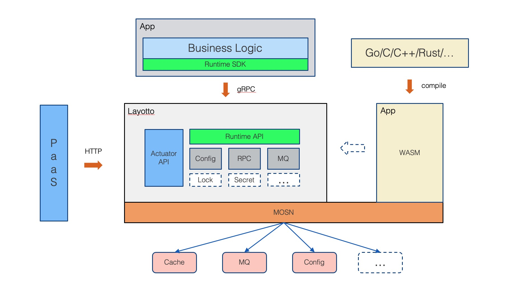

[English Version](README.md)

LayOtto 是一款使用Golang开发的runtime, 为应用提供了各种分布式能力，比如状态管理，配置管理，事件驱动等能力，以简化应用的开发。

LayOtto 以开源的[MOSN](https://github.com/mosn/mosn) 为底座，在提供分布式能力以外，提供了Service Mesh对于流量的管控能力。

## 功能

- 数据流量的劫持和观测
- 服务的限流能力
- 配置中心读写监听

## 工程架构

如下图架构图所示，LayOtto以开源MOSN作为底座，在提供了网络层管理能力的同时提供了分布式能力，业务可以通过轻量级的sdk直接与LayOtto进行交互，而无需关注后端的具体的基础设施。

LayOtto提供了各个语言版本的sdk，sdk通过grpc与LayOtto进行交互，应用开发者只需要通过LayOtto提供的配置文件[配置文件](./configs/runtime_config.json)来指定自己基础设施类型，而不需要进行任何编码的更改，大大提高了程序的可移植性。

## 快速开始

### 配置中心演示

[通过LayOtto调用etcd配置中心](docs/zh/start/configuration/start.md) 

[通过LayOtto调用apollo配置中心](docs/zh/start/configuration/start-apollo.md) 

### 在四层网络进行流量干预

[Dump TCP流量](docs/zh/start/network_filter/tcpcopy.md)

### 在七层网络进行流量干预

[方法级别限流](docs/zh/start/network_filter/flow_control.md)

## 如何贡献代码

请参阅[贡献者指南](CONTRIBUTING_ZH.md)。

## 社区

使用 [钉钉](https://www.dingtalk.com/) 扫描下面的二维码加入 LayOtto 用户交流群。

或者通过钉钉搜索群号31912621，加入用户交流群。

