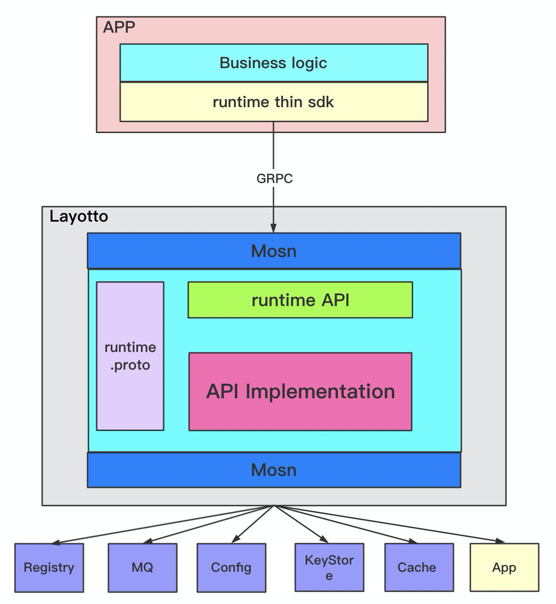

[查看中文版本](README-ZH.md)

LayOtto is a runtime developed using Golang, which provides various distributed capabilities for applications, such as state management, configuration management, and event-driven capabilities to simplify application development.

LayOtto uses the open source [Mosn](https://github.com/mosn/mosn) as the base, in addition to providing distributed capabilities, it also provides serviceMesh's ability to control traffic.

## Features

- Hijacking and observation of data traffic
- The current limiting capability of the service
- Configuration center read and write monitoring capabilities

## Project Architecture

As shown in the architecture diagram below, LayOtto uses the open source mosn as the base to provide network layer management capabilities while providing distributed capabilities. The business can directly interact with LayOtto through a lightweight SDK without paying attention to the specific back-end infrastructure.

LayOtto provides sdk in various languages. The sdk interacts with LayOtto through grpc. Application developers only need to specify their own infrastructure type through the configuration file [configure file](./configs/runtime_config.json) provided by LayOtto. Any coding changes are required, which greatly improves the portability of the program.

## Quickstarts and Samples

### Get started with LayOtto

- See the code examples [configuration demo with etcd](docs/en/start/configuration/start.md) or [configuration demo with apollo](docs/en/start/configuration/start-apollo.md) that can help you get started with LayOtto.

### Traffic intervention on the 4th layer network

[Dump TCP Traffic](docs/en/start/network_filter/tcpcopy.md)

## Contributing to LayOtto

See the Development Guide [contributing](CONTRIBUTING.md) to get started with building and developing.

## Community

### Contact Us

Use [DingTalk](https://www.dingtalk.com/en) to scan the QR code below to join the LayOtto user exchange group.

Or through Dingding search group number 31912621, join the user exchange group.