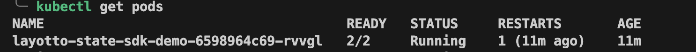
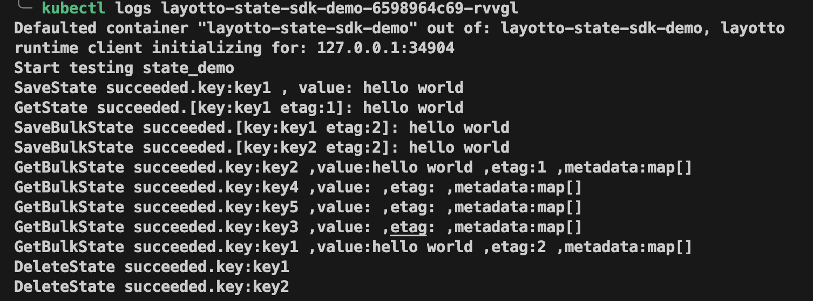

# Prerequisites
This Layotto state SDK client demo requires you to have the following installed on your machine:

- [kubectl](https://kubernetes.io/docs/tasks/tools/)
- A Kubernetes cluster, such as [Minikube](https://minikube.sigs.k8s.io/docs/start/), [Kind](https://kind.sigs.k8s.io/docs/user/quick-start/)
- [Helm v3](https://helm.sh/docs/intro/install/)

# Step 1 - Setup Layotto sidecar injector on your Kubernetes cluster
1. Use Kind to quickly build a local Kubernetes cluster
```
kind create cluster --name layotto-cluster
kubectl config use-context kind-layotto-cluster
```
2. Install the layotto sidecar injector chart on your cluster in the layotto-system namespace
```
helm install injector oci://docker.io/layotto/injector-helm --version v0.5.0 -n layotto-system --create-namespace --wait
```

# Step 2 - Use Helm to deploy Redis on your Kubernetes cluster
`Redis` is an open source, advanced key-value store. It is often referred to as a data structure server since keys 
can contain strings, hashes, lists, sets and sorted sets.

Here we use `Redis` to persist and retrieve state.

```
helm repo add bitnami https://charts.bitnami.com/bitnami
helm repo update
helm install redis bitnami/redis --set image.tag=6.2 --set auth.enabled=false
```

# Step 3 - Deploy the layotto state client with the Layotto sidecar
1. Create a ConfigMap named `layotto-config` and populate its data from the `config.json` file
```
kubectl create configmap layotto-config --from-file=./config.json
```
2. Deploy Layotto state SDK client App
```
kubectl apply -f ./state-sdk-demo.yaml
```

Let's take a look at the important annotations in state-sdk-demo.yaml
- `layotto/sidecar-inject: "true"` - this tells the Layotto sidecar injector to inject a sidecar to this deployment.
- `layotto/config-volume: "layotto-config-vol` - this tells the Layotto sidecar injector which config Volume resource to 
mount into layout container.

The `layotto-config` ConfigMap is mounted as a volume, and all contents stored in its `config.json` entry are mounted into 
the layotto sidecar container at path `/runtime/configs`. The successfully mounted `config.json` file will be used as the configuration 
file when Layotto starts.

# View program running results
If the following information is printed, the demo succeeded:



