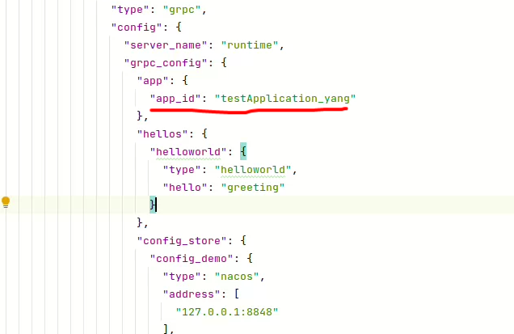

# Nacos

## Configuration Items Description

Example: configs/config_nacos.json

| Field                 | Required | Description                                                                                                                           |
|-----------------------|----------|---------------------------------------------------------------------------------------------------------------------------------------|
| address               | Y        | Nacos server address in <ip:port> format. By default, `/nacos` is used as the URL context, and `http` is used as the connection protocol. If the ACM connection field is not specified in the configuration file, this field is **required**. Multiple address addresses can be provided for connection. |
| timeout               | N        | Timeout for connecting to the Nacos server, in seconds. Default is 10s.                                                                 |
| metadata.namespace_id | N        | Nacos namespace for isolating configuration files at the namespace level. Default is empty, which represents using the "default" namespace in Nacos.                                             |
| metadata.username     | N        | Username for Nacos service authentication verification.                                                                                 |
| metadata.password     | N        | Password for Nacos service authentication verification.                                                                                 |
| metadata.end_point    | N        | ACM mode field indicating the address of the connected Nacos service. [Reference](https://help.aliyun.com/document_detail/130146.html)                                                  |
| metadata.region_id    | N        | ACM mode field indicating the region where the Nacos service is located.                                                                |
| metadata.access_key   | N        | ACM mode field representing the access key in Alibaba Cloud Nacos service.                                                              |
| metadata.secret_key   | N        | ACM mode field representing the secret key in Alibaba Cloud Nacos service.                                                              |
| metadata.log_dir      | N        | Directory address for Nacos Go SDK output log files. Default directory name is `/tmp/layotto/nacos/logs`, and the default log name is `nacos-sdk.log`.                                                |
| metadata.log_level    | N        | Log level for Nacos Go SDK output. Supported log levels are `debug`, `info`, `warn`, `error`. Default log level is `debug`.                                                                     |
| metadata.cache_dir    | N        | File path for Nacos configuration local cache. Default cache path is `/tmp/layotto/nacos/cache`.                                      |

> If any ACM field appears in the configuration file, Layotto connects to the Nacos service in ACM mode and ignores the `address`, `username`, `password`, and other fields.

## Other Configuration Items

The `app_id` field needs to be configured, and it is a required field. It represents the category of the app and supports configuring isolation for different app services at the configuration center level.

However, it is not added in the configuration of the Nacos ConfigStore component but in additional configuration items, making it convenient for other components that need to reuse `app_id`.

## How to Start Nacos

You can refer to the [official Nacos documentation](https://nacos.io/en-us/docs/quick-start-docker.html) for instructions on how to start Nacos.

After deployment, you need to modify the Layotto [config file](https://github.com/mosn/layotto/blob/main/configs/config_nacos.json) and replace the Nacos server address and other information with your own.