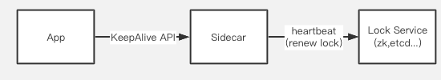
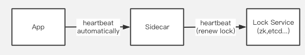

# 0. tl;dl
This proposal try to add TryLock and Unlock API.

The Lock Renewal API might be controversial and will not be added into the first version

# 1. Why it is needed
Application developers need distributed locks to keep their data safe from race conditions,but implementing a distributed lock correctly is challenging,since you have to be careful to prevent deadlock or some incorrect corner cases from happening.

An easy-to-use distributed lock API provided by runtime sidecar can be helpful. 


# 2. Evaluation of products on the market
| **System** | **tryLock(non-blocking lock)** | **Blocking lock(based on watch)** | **Availability** | **Write operations are linearizable** | **sequencer([chubby's feature](https://static.googleusercontent.com/media/research.google.com/zh-TW//archive/chubby-osdi06.pdf))** | **Lock renewal** |
| --- | --- | --- | --- | --- | --- | --- |
| Stand-alone redis | yes | x | unavailable when single failure | yes | yes(need poc) | yes |
| redis cluster | yes | x | yes | no. Locks will be unsafe when fail-over happens | yes(need poc) | yes |
| redis Redlock | yes | | | | | |
| consul | yes | | | | | |
| zookeeper | yes | yes | yes. [the election completes within 200 ms](https://pdos.csail.mit.edu/6.824/papers/zookeeper.pdf) | yes | yes use zxid as sequencer | yes |
| etcd | yes | yes | yes | yes | yes use revision | yes lease.KeepAlive |

There are some differences in feature supporting.

# 2. High-level design
## 2.1. API
### 2.1.0. Design principles
We are faced with many temptations. In fact, there are many lock related features that can be supported (blocking locks, reentrant locks, read-write locks, sequencer, etc.)

But after all, our goal is to design a general API specification, so we should be as conservative as possible in API definition.Start simple, abstract the simplest and most commonly used functions into API specifications, and wait for user feedback before considering adding more abstraction into API specification.

### 2.1.1. TryLock/Unlock API
The most basic locking and unlocking API.

TryLock is non-blocking, it return directly if the lock is not obtained.

proto:

```protobuf
  // Distributed Lock API
  // A non-blocking method trying to get a lock with ttl.
  rpc TryLock(TryLockRequest)returns (TryLockResponse) {}

  rpc Unlock(UnlockRequest)returns (UnlockResponse) {}


message TryLockRequest {
  // Required. The lock store name,e.g. `redis`.
  string store_name = 1;

  // Required. resource_id is the lock key. e.g. `order_id_111`
  // It stands for "which resource I want to protect"
  string resource_id = 2;

  // Required. lock_owner indicate the identifier of lock owner.
  // You can generate a uuid as lock_owner.For example,in golang:
  //
  // req.LockOwner = uuid.New().String()
  //
  // This field is per request,not per process,so it is different for each request,
  // which aims to prevent multi-thread in the same process trying the same lock concurrently.
  //
  // The reason why we don't make it automatically generated is:
  // 1. If it is automatically generated,there must be a 'my_lock_owner_id' field in the response.
  // This name is so weird that we think it is inappropriate to put it into the api spec
  // 2. If we change the field 'my_lock_owner_id' in the response to 'lock_owner',which means the current lock owner of this lock,
  // we find that in some lock services users can't get the current lock owner.Actually users don't need it at all.
  // 3. When reentrant lock is needed,the existing lock_owner is required to identify client and check "whether this client can reenter this lock".
  // So this field in the request shouldn't be removed.
  string lock_owner = 3;

  // Required. expire is the time before expire.The time unit is second.
  int32 expire = 4;
}


message TryLockResponse {

  bool success = 1;
}

message UnlockRequest {
  string store_name = 1;
  // resource_id is the lock key.
  string resource_id = 2;

  string lock_owner = 3;
}

message UnlockResponse {
  enum Status {
    SUCCESS = 0;
    LOCK_UNEXIST = 1;
    LOCK_BELONG_TO_OTHERS = 2;
    INTERNAL_ERROR = 3;
  }

  Status status = 1;
}

```

**Q: What is the time unit of the expire field?**

A: Seconds.

**Q: Can we force the user to set the number of seconds to be large enough(instead of too small)?**

A: There is no way to limit it at compile time or startup, forget it

**Q: What would happen if different applications pass the same lock_owner?**

case 1. If two apps with different app-id pass the same lock_owner,they won't conflict because lock_owner is grouped by 'app-id ',while 'app-id' is configurated in sidecar's static config(configurated in config.json or passed as parameters at startup)

case 2.If two apps with same app-id pass the same lock_owner,they will conflict and the second app will obtained the same lock already used by the first app.Then the correctness property will be broken.

So user has to care about the uniqueness property of lock_owner.

**Q: Why not add metadata field**

A: Try to be conservative at the beginning, wait until someone feedbacks that there is a need, or find that there is a need to be added in the process of implementing the component

**Q: How to add features such as sequencer and reentrant locks in the future?**

A: Add feature options in the API parameters,and the component must also implement the Support() function

### 2.1.2. Lock Renewal API
Renewal API aims to refresh the existing lock and postpone the expiration time.

Lock Renewal API won't be in the first version of this API. Here are some considerations for discussion.

#### Solution A: add an API "LockKeepAlive"
 

```protobuf
rpc LockKeepAlive(stream LockKeepAliveRequest) returns (stream LockKeepAliveResponse){}
  
message LockKeepAliveRequest {
  // resource_id is the lock key.
  string resource_id = 1;

  string lock_owner = 2;
  // expire is the time to expire
  int64 expire = 3;
}

message LockKeepAliveResponse {
  enum Status {
    SUCCESS = 0;
    LOCK_UNEXIST = 1;
    LOCK_BELONG_TO_OTHERS = 2;
  }
  // resource_id is the lock key.
  string resource_id = 1;

  Status status = 2;
}
```

Users have to start a thread or coroutine to periodically renew the lock.

The input parameters and return results of this API are all streams. App and sidecar only need to maintain one connection. Each time the lock needs to be renewed, the connection is reused to transfer the renewal request.

**Q: Why not put the lock renewal as a stream parameter into tryLock?**

- Lock renewal is not a high frequency demand, so we want trylock to be as simple as possible;

- Single responsibility principle.When we want to add a blocking lock,the renewal API can be reused;

**Q: The renewal logic is too complicated, can we make it transparent to users?**

A: sdk can do this logic for users.Sdk will start a thread,coroutine or nodejs timing event to automatically renew the lease


#### Solution B: Make users not aware of the renewal logic
Our sidecar can automatically renew the lease with heartbeat. App and sidecar maintain a heartbeat for failure detection.



Disadvantages/difficulties:

1. If we reuse a public heartbeat, it is difficult to customize the heartbeat interval

An option is to ensure that the heartbeat interval low enough, such as 1 time per second

2. How to ensure reliable failure detection?

For example, the following java code `unlock()` method may fail:

```java
try{

}finally{
  lock.unlock()
}
```

If it is a lock in JVM, unlock can guarantee success (unless the entire JVM fails), but unlock may fail if it is called via the network. How to ensure that the heartbeat is interrupted after the call fails?

Here shows the corner case:


Solving this case requires the app to report some fine-grained status with the heartbeat.

We can define a http callback SPI, which is polled and detected by the sidecar, and the data structure returned by the callback is as follows:

```json
{
  "status": "UP",
  "details": {
    "lock": [
      {
        "resource_id": "res1",
        "lock_owner": "dasfdasfasdfa",
        "type": "unlock_fail"
      }
    ],
    "xxx": []
  }
}
```

The application has to handle status collection, reporting, cleaning up after the report is successful, and limiting the map capacity (for example, what if the map is too large when report fails too much times?), which requires the app to implement some complex logic, and it must be put in the SDK.

3. This implementation is actually the same as Solution A. It opens a separate connection for status management and failure detection, and user reports the status through this public connection when necessary.

4. Solution B actually make API spec rely on heartbeat logic. It relies on the heartbeat interval and the data structure returned by the heartbeat. It is equivalent to that the API spec relies on the implementation of sidecar, unless we can also standardize the heartbeat API (including interval, returned data structure, etc.)

#### Conclusion
At present, the Lock Renewal API might be controversial and will not be added into the first version.

Personally I prefer the solution A.Let the SDK do the renewal logic. Although users have to directly deal with the lease renewal logic when using grpc, it is not hard for developers to understand.

I put it here to see your opinion.

# 3. Future work

- Reentrant Lock

There will be some counting logic.We need to consider whether all locks support reentrancy by default, or add a feature option in the parameter to identify that the user needs it to be reentrant

- Heartbeat API

If we want to implement more coordinator APIs such as blocking lock and leader election,we need a heartbeat API for failure detection,like `LeaseKeepAlive` in Etcd.

- Blocking lock

- Sequencer

# 4. Reference

[How to do distributed locking](https://martin.kleppmann.com/2016/02/08/how-to-do-distributed-locking.html)

[The Chubby lock service for loosely-coupled distributed systems](https://static.googleusercontent.com/media/research.google.com/zh-TW//archive/chubby-osdi06.pdf)