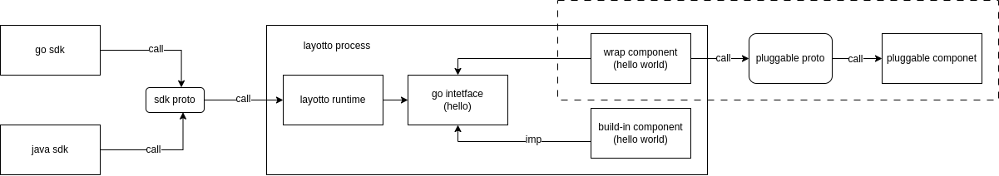

# Pluggable Component Design Document

## Background

Currently, the components of Layotto are implemented in Layotto's projects, which requires users to develop new components using Golang language and implement them in the Layotto project before compiling them uniformly.
It is very unfriendly for multilingual users, so Layotto needs to provide the capability of pluggable components, allowing users to implement their own components in any language. Layotto communicates with external components through the GRPC protocol.

## Programme

- Implementing local cross language component service discovery based on UDS (Unix domain socket) to reduce communication overhead.
- Implement cross language implementation capabilities for components based on protobuf.

## Data Flow Architecture

This is the data flow starting from the current user's call to SDK. 
The dashed portion is the data flow that the pluggable component primarily participates in.

### Component Discovery

As shown in the above figure, the user-defined component starts the socket service and places the socket file in the specified directory. 
When Layotto starts, it will read all socket files in the directory (skipping folders) and establish a socket connection.

At present, layotto aligns with dapr and is not responsible for the lifecycle of user components.
If the user components are offline during the service period, there will be no reconnection, and the component service cannot be used.

Based on the usage of the community, it will be decided whether Layotto needs to support a process management module or use a separate service for management.

Due to the incomplete support for UDS in Windows and the cancellation of compatibility with Windows by Layotto itself, 
the new feature adopts a UDS discovery mode that is not compatible with Windows systems.

## Component Register

- As shown in the data flow framework composition above, the components registered by the user need to implement the GRPC service defined by the pluggable proto.
Layotto will generate golang's grpc file based on the protobuf idl. Here Corresponds to the wrap component in the data flow diagram.
- There is no difference between wrap component and build in component for layotto runtime, and there is no special perception for users.
- Layotto uses the GRPC reflect library to obtain which components are implemented by the user's provided services, and registers them in the global component registry for users to use.

