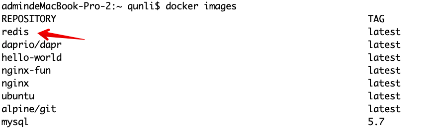

# Implementing Pub/Sub Pattern using Layotto and Redis

## Quick start

This example shows how to call redis through Layotto to publish/subscribe messages.

The architecture of this example is shown in the figure below. The running processes are: redis, a Subscriber program that listens to events, Layotto, and a Publisher program that publishes events.


### Deploy and Run Redis in Docker

1. Get the latest version of Redis image.
   
Here we pull the latest version of the official image:

```shell
docker pull redis:latest
```

2. Check local mirror

Use the following command to check whether Redis is installed:

```shell
docker images
```


3. Run the container

After the installation is complete, we can use the following command to run the Redis container:

```shell
docker run -itd --name redis-test -p 6380:6379 redis
```

Parameter Description:

-p 6380:6379: Map port 6379 of the container to port 6380 of the host. The outside can directly access the Redis service through the host ip:6380.

### Start the Subscriber program and subscribe to events
```bash
 cd ${projectpath}/demo/pubsub/redis/server/
 go build -o subscriber
 ./subscriber
```
If the following information is printed out, it means the startup is successful:

```shell
Start listening on port 9999 ...... 
```

Explanation:

The program will start a gRPC server and open two API:

- ListTopicSubscriptions

Calling this API will return the topics subscribed by the application. This program will return "topic1"

- OnTopicEvent

When a new event occurs, Layotto will call this API to notify the Subscriber of the new event.

After the program receives a new event, it will print the event to the command line.

### Run Layotto

After downloading the project code to the local, switch the code directory and compile:

```bash
cd ${projectpath}/cmd/layotto
go build
```

After completion, the layotto file will be generated in the directory, run it:

```bash
./layotto start -c ../../configs/config_apollo_health_mq.json
```

### Run the Publisher program and call Layotto to publish events

```bash
 cd ${projectpath}/demo/pubsub/redis/client/
 go build -o publisher
 ./publisher
```

If the following information is printed, the call is successful:

```bash
Published a new event.Topic: topic1 ,Data: value1 
```

### Check the event message received by the subscriber

Go back to the subscriber's command line and you will see that a new message has been received:

```shell
Start listening on port 9999 ...... 
Received a new event.Topic: topic1 , Data:value1 
```

### Next Step
#### Use sdk or grpc client
The example Publisher program uses the golang version SDK provided by Layotto. The SDK is located in the `sdk` directory. Users can directly call the services provided by Layotto through the corresponding SDK.

In addition to using sdk, you can also interact with Layotto directly through grpc in any language you like.

#### Understand the principle of Pub/Sub API implementation

If you are interested in the implementation principle, or want to extend some functions, you can read [Pub/Sub API design document](../../design/pubsub/pubsub API and compatibility with Dapr.md)