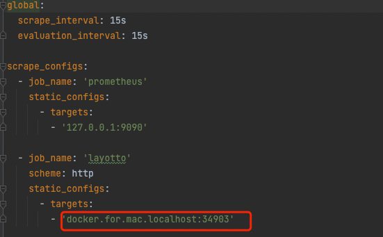

# Prometheus metrics 

## Run prometheus

window users need to change the layotto in prometheus.yml to 'docker.for.windows.localhost:34903'



```shell
cd ${project_path}/demo/prometheus

docker-compose -f prometheus-docker-compose.yaml up -d
```

## Run layotto

A layotto server can be started as follows.

```shell
cd ${project_path}/cmd/layotto
go build -o layotto
```shell @if.not.exist layotto
# build it
go build -o layotto
```

Run it:

```shell @background
./layotto start -c ../../configs/config_trace_skywalking.json
```
```

## Run Demo

The corresponding call-side code is in [client.go](https://github.com/mosn/layotto/blob/main/demo/flowcontrol/client.go), and running it calls layotto's SayHello interface.

```shell
 cd ${project_path}/demo/flowcontrol/
 go build -o client
 ./client
```

Access http://127.0.0.1:9090/graph?g0.expr=grpc_request_total


Release resources

````shell
cd ${project_path}/demo/prometheus

docker-compose -f prometheus-docker-compose.yaml down
````