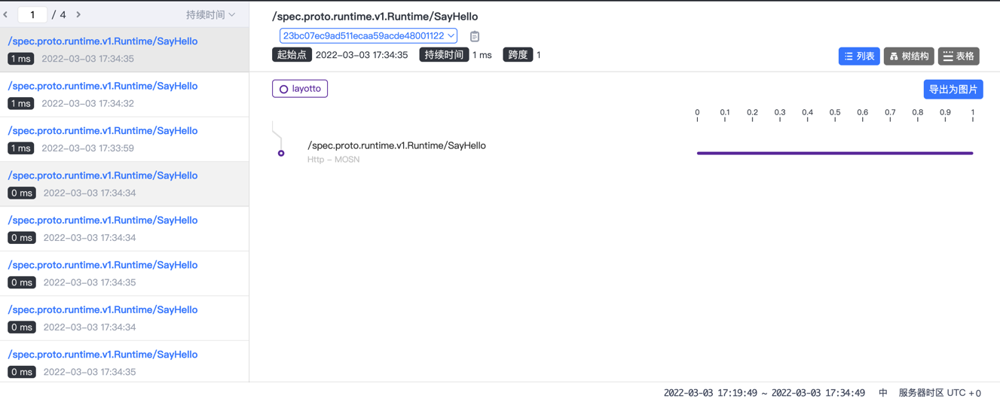

# Skywalking trace 

## Configuration

Example: configs/config_trace_skywalking.json

````json
{
  "tracing": {
    "enable": true,
    "driver": "SkyWalking",
    "config": {
      "reporter": "gRPC",
      "backend_service": "127.0.0.1:11800",
      "service_name": "layotto"
    }
  }
}
````

| Field            | Required fields | Description  |
|------------------|-----|--------------------------|
| reporter         | Y   | Reporting method grpc               |
| backend_service  | Y   | skywalking oap server address |
| service_name     | Y   | Service Name                     |

## Run skywalking

```shell
docker-compose -f diagnostics/skywalking/skywalking-docker-compose.yaml up -d
```

## Run layotto
<!-- tabs:start -->
### **with Docker**
You can run Layotto with docker

```bash
docker run -d \
  -v "$(pwd)/configs/config_trace_skywalking.json:/runtime/configs/config.json" \
  -p 34904:34904 --network=skywalking_default --name layotto \
  layotto/layotto start
```

### **Compile locally (not for Windows)**
You can compile and run Layotto locally.

> [!TIP|label: Not for Windows users]
> Layotto fails to compile under Windows. Windows users are recommended to deploy using docker

```shell 
cd ${project_path}/cmd/layotto_multiple_api/
```

Build it:

```shell @if.not.exist layotto
go build -o layotto
```

Run it:

```shell @background
./layotto start -c ../../configs/config_trace_skywalking.json
```

<!-- tabs:end -->

## Run Demo

```shell
 cd ${project_path}/demo/flowcontrol/
```

Build the demo client:

```shell @if.not.exist client
 go build -o client
```

Run the demo client:

```shell 
 ./client
```

Access http://127.0.0.1:8080



## Release resources
If you run Layotto with docker, remember to shut it down:

```bash
docker rm -f layotto
```

Shutdown skywalking:

```shell
cd ${project_path}/diagnostics/skywalking

docker-compose -f skywalking-docker-compose.yaml down
```
