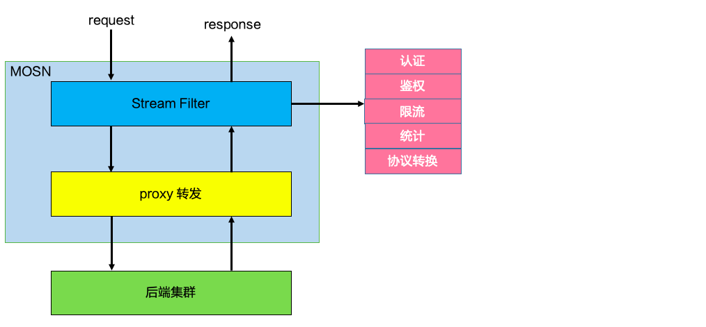
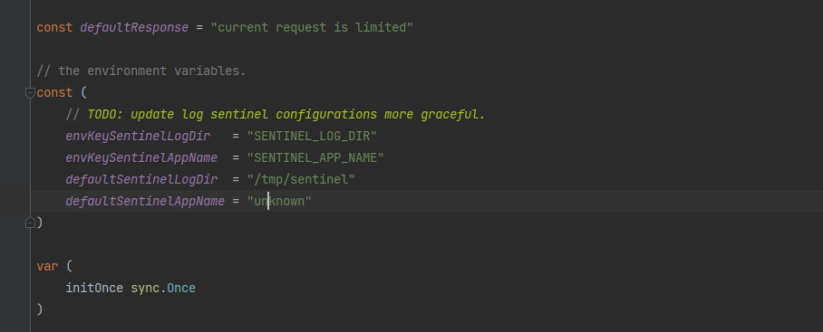
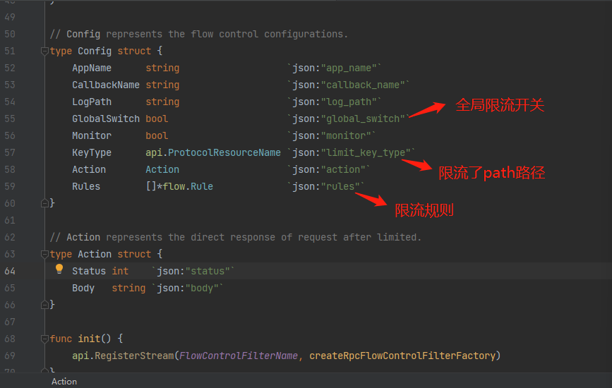
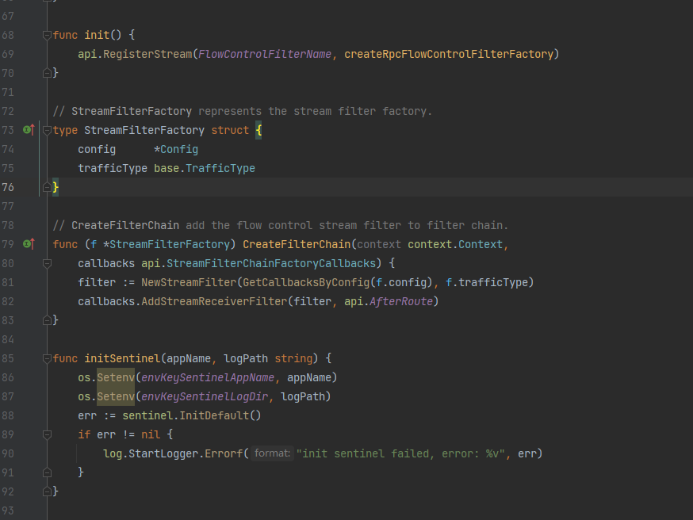
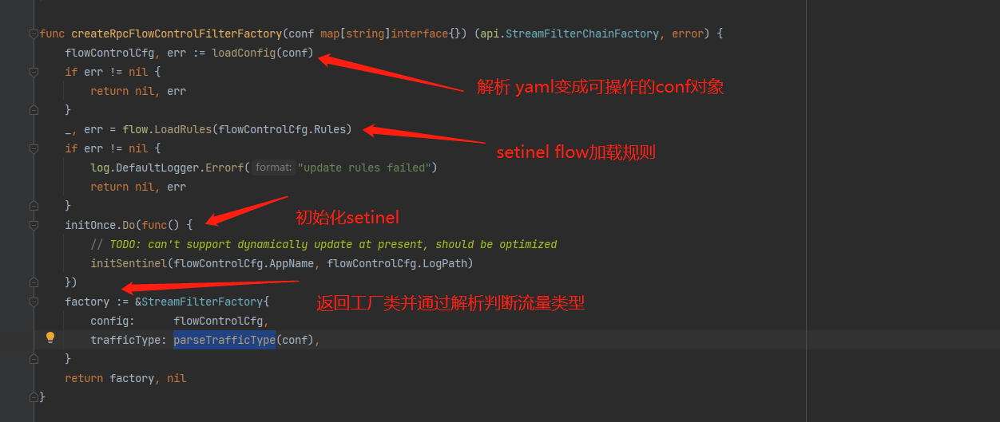
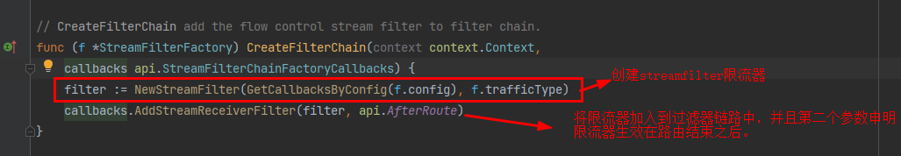
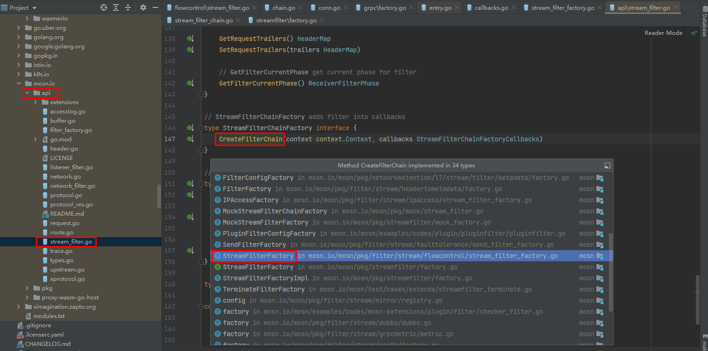
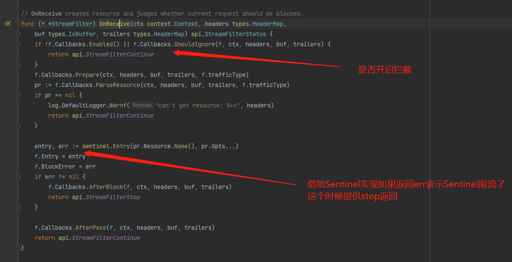

# 源码解析 7层流量治理,接口限流

>作者简介：
张晨，是开源社区的爱好者，致力于拥抱开源，希望能和社区的各位开源爱好者互相交流互相进步和成长。

## Overview
此文档的目的在于分析接口限流的实现

## 前提：
文档内容所涉及代码版本如下

[https://github.com/mosn/mosn](https://github.com/mosn/mosn)

Mosn   d11b5a638a137045c2fbb03d9d8ca36ecc0def11（develop分支）

## 源码分析
### 总体分析
参考  [https://mosn.io/docs/concept/extensions/](https://mosn.io/docs/concept/extensions/) Mosn扩展拦截体系

### stream_filter_factory.go分析
此类为一个工厂类那么推测一下应该是用作生产stream_filter的一个作用

定义了一些常量用作默认值

定义了限流配置类用作加载yaml定义并且解析生产出对应的功能

init() 初始化内部就是将 name 和 对应生产函数存储到 filter拦截工厂的map中

着重讲一下 createRpcFlowControlFilterFactory  生产出rpc流控工厂

在查看streamFilter之前我们来看看工厂类是如何生产出限流器的

限流器加入到限流链路结构中按照设定顺序依次生效。 我们可以看到一个公共方法将各种各样的filter生效借助他们的工厂类

我们可以看到有各种各样的工厂类包括我们今天研究的限流工厂类实现了此接口

### Stream_filter.go分析

## 整体流程：
最后我们再来回顾一下整体流程走向:

1.从stream_filter_factory.go的初始化函数开始 init() 我们向creatorStreamFactory(map类型)插入了名称和限流工厂生成方法 createRpcFlowControlFilterFactory.

2.Mosn创建出一个filter chain在mosn/streamfilter/factory.go 中 CreateFilterChain 循环中使用 CreateFilterChain 创建出所有到filter包括我们今天的主人公限流器.

3.创建限流器 NewStreamFilter().

4.当流量通过mosn的时候会进入到限流器的方法 OnReceive() 中并最终借助sentinel实现判断是否已经达到阈值并且判断是放行流量还是拦截流量(StreamFilterStop or StreamFilterContinue).

