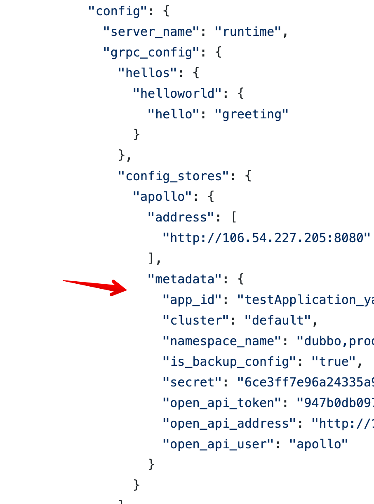

# Apollo

## 配置项说明
示例：configs/config_apollo.json

| 字段 | 必填 | 说明 |
| --- | --- | --- |
| address | Y | apollo服务器地址，数组类型 |
| metadata.app_id | Y | 对应apollo数据模型中的application |
| metadata.cluster | Y | 对应apollo数据模型中的cluster |
| metadata.namespace_name | Y | 对应apollo数据模型中的namespace，可以配置多个、用逗号分隔，例如"dubbo,product.joe,application" |
| metadata.is_backup_config | N | 是否将配置备份到本地文件，对应[agollo sdk](https://github.com/apolloconfig/agollo/wiki/%E4%BD%BF%E7%94%A8%E6%8C%87%E5%8D%97) 的is_backup_config配置项。默认值是true |
| metadata.secret | N | 访问apollo的secret |
| metadata.open_api_address | Y | apollo open-api的地址（open-api用于做配置变更操作，和查询用的apollo服务器地址不一样哦） |
| metadata.open_api_token | Y | 访问apollo open-api需要的token |
| metadata.open_api_user | Y | 访问apollo open-api的用户 |

## 怎么启动Apollo
使用项目中的demo无需自己部署apollo服务器。demo会使用apollo官方 提供的演示环境http://81.68.181.139

如果您想自己部署apollo，可以参考[apollo 官方文档](https://www.apolloconfig.com/#/zh/deployment/quick-start)

部署后需要修改Layotto的[config文件](https://github.com/mosn/layotto/blob/main/configs/config_apollo.json) ，将apollo服务器地址等信息改成您自己的。
