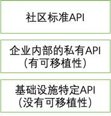

# Hierarchical API design
## 1. 需求分析
### 1.1. 解决什么问题
解决扩展性问题。不管是Dapr还是开源Layotto的API，目前都无法完全满足生产需求。

回看操作系统领域POSIX API和system call的发展历史，我们可以学到很多，借此预测Runtime的未来。我们可以说，Runtime API将来也不可能完全满足用户需求。想想OS领域，即使有POSIX API了，一些场景还是需要绕开标准API、用特殊指令操作特殊硬件。


Dapr的扩展性是通过Binding API解决，但是这种非结构化的API有很多问题（比如破坏可移植性、不支持stream等语义）

### 1.2. 用户场景和需求
举例来说，有以下用户场景：
1. 公司有自己的定制API需求，因为是非通用需求、不适合做到开源Layotto/Dapr上，于是公司的中间件团队想自己开发到sidecar里。如果公司的项目import 开源Layotto或者Dapr，按目前的架构是没法扩展开发API的，只能Fork出来做扩展


这种情况下的用户需求：
- sdk下沉；
- 支持多语言；
- 多云部署（只不过需要中间件团队自己为多云环境开发组件，没有社区现成的组件拿来用了）

2. 公司有新API需求，适合做到开源项目里，于是提需求给社区，但是社区很难达成共识、争了几个月还没落地（例如https://github.com/dapr/dapr/issues/2988 ）。这种情况公司可能有业务压力，没法等那么久，希望自己先实现、落地，等社区实现新功能后再迁移过来。

这种情况下的用户需求：
- 用户对该功能自主可控，不需要（同时用中文和英文）说服社区、说服世界才能做这个功能
- 快速扩展、服务业务

3. 用户想给Dapr API加字段，先在自己的Fork版本里添加了字段、满足线上需求，然后将PR提给社区。社区拒绝添加该字段，PR被关闭。用户很尴尬：这字段已经在线上使用了，怎么处理？

## 2. High level design
### 2.1. Hierarchical API
参考OS领域当年是怎么定API的，我们可以把Runtime API设计成多层：



  
分别对应OS领域的：
- POSIX API
- 各种Unix-like系统自己的System Call （有可移植性，通过不同的硬件驱动实现相同的接口）
- 特殊硬件提供的特殊功能 (没有可移植性)

基于这种思想，我们可以设计API插件，支持用户扩展自己的私有API


### 2.2. 设计目标
1. 让有定制开发需求的开源用户通过import Layotto的方式使用Layotto,而不是Fork

2. 开发api plugin足够简单

3. 配置文件公用同一个json，新增api plugin无需新增配置文件

### 2.3. 用户扩展开发时的编程界面


#### step 1. 实现自己的私有API

如果需要自己的私有API，用户需要实现GrpcAPI interface，以及相应的构造函数。

这个GrpcAPI就是您自己的API，它需要实现一些生命周期管理方法。目前只定义了Init和Register。
  
```go
// GrpcAPI is the interface of API plugin. It has lifecycle related methods
type GrpcAPI interface {
	// init this API before binding it to the grpc server. For example,you can call app to query their subscriptions.
	Init(conn *grpc.ClientConn) error
	// Bind this API to the grpc server
	Register(s *grpc.Server, registeredServer mgrpc.RegisteredServer) mgrpc.RegisteredServer
}

// NewGrpcAPI is the constructor of GrpcAPI
type NewGrpcAPI func(
	appId string,
	hellos map[string]hello.HelloService,
	configStores map[string]configstores.Store,
	rpcs map[string]rpc.Invoker,
	pubSubs map[string]pubsub.PubSub,
	stateStores map[string]state.Store,
	files map[string]file.File,
	lockStores map[string]lock.LockStore,
	sequencers map[string]sequencer.Store,
	sendToOutputBindingFn func(name string, req *bindings.InvokeRequest) (*bindings.InvokeResponse, error),
) GrpcAPI

```

#### step 2. 将自己的API注册进Layotto

用户可以把Layotto的main复制粘贴出来，按需修改，去掉用不到的东西（比如用不到etcd的分布式锁组件，可以在自己的main里删掉它)

如果用户写了自己的API,可以在main里将它注册进Layotto

```go

func NewRuntimeGrpcServer(data json.RawMessage, opts ...grpc.ServerOption) (mgrpc.RegisteredServer, error) {
	// ...........
	
    // 3. run
    server, err := rt.Run(
        runtime.WithGrpcOptions(opts...),
        // register your grpc API here
        runtime.WithGrpcAPI(
            // Layotto API
            l8grpc.NewLayottoAPI,
            // a demo to show how to register your own API
            helloworld_api.NewHelloWorldAPI,
        ),
        // Hello
        runtime.WithHelloFactory(
            hello.NewHelloFactory("helloworld", helloworld.NewHelloWorld),
        ),
    // ...........
```

#### step 3. 编译运行Layotto
Layotto启动过程中，会回调每个注册进来的API的生命周期方法(Init,Register)

启动完成后，您的API就会对外提供 grpc 服务