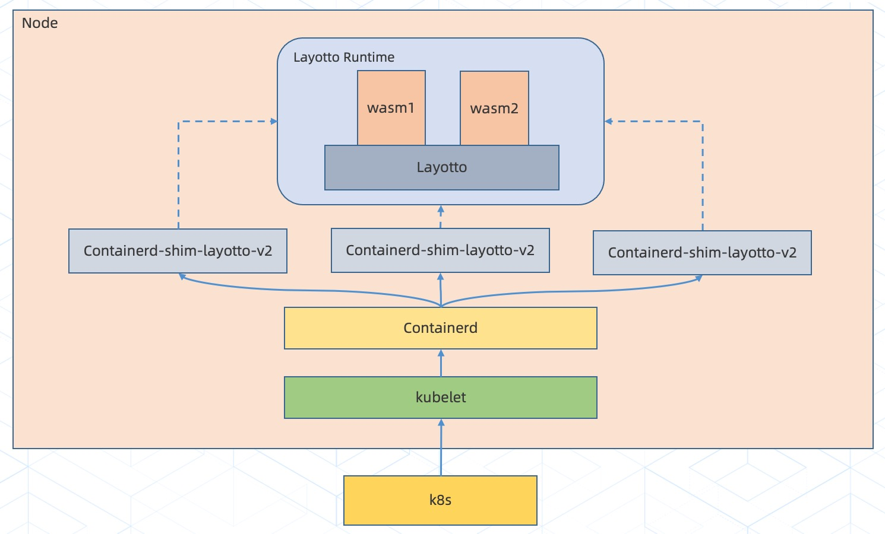

## FaaS设计文档

### 一、架构设计

基于k8s的生命周期管理及调度策略，结合Containerd的v2接口定义，自定义了Containerd-shim-layotto-v2插件，把容器运行时改造为Layotto Runtime，如k8s创建容器的动作变成了加载 wasm 形态的函数并运行。

得益于 WebAssembly 优秀的沙箱隔离环境，Layotto 作为基座可以加载运行多个 wasm 形态的函数，它们虽然都跑在一个进程里但互不影响，这种进程虚拟化的思路相比于 docker 可以进一步充分利用资源。

### 二、核心组件

#### A、[WebAssembly（wasm）](https://webassembly.org/)

对应架构图中的 wasm1，wasm2，它们作为函数存在的形式，把开发好的函数编译成`*.wasm`形式并运行，充分利用 WebAssembly 这项技术提供的沙箱隔离环境，达到函数之间互不影响的目的。

#### B、[Layotto](https://github.com/mosn/layotto)

定位是为函数提供服务，资源，安全三大保障。作为函数运行的基座，提供包括 WebAssembly 运行时，基础设施访问入口，函数可使用最大资源限制，函数进行系统调用权限验证等功能。

#### C、[Containerd](https://containerd.io/)

官方支持的容器运行时，docker 是目前使用场景最多的一种实现，此外kata, gvisor等安全容器也使用了该技术，Layotto也借鉴了它们的实现思路，把函数加载运行的过程融入到容器运行时的具体实现中。

#### D、[Containerd-shim-layotto-v2](https://github.com/layotto/containerd-wasm)

基于Containerd的V2接口定义，定制了容器运行时逻辑，比如创建容器的动作实现为让Layotto加载并运行wasm函数。

#### E、[Kubernetes](https://kubernetes.io/)

当前容器调度的事实标准，生命周期管理及调度策略足够优秀，基于containerd的方案也是为了能让函数的调度跟k8s生态完美结合。

### 三、Runtime ABI

#### A. [proxy-wasm-go-sdk](https://github.com/layotto/proxy-wasm-go-sdk)

定义了函数访问系统资源及基础设施服务的接口，基于社区的 [proxy-wasm/spec](https://github.com/proxy-wasm/spec) 实现，在此基础上结合[Runtime API](../../../../spec/proto/runtime/v1/runtime.proto) 的思路，增加了对基础设施访问的ABI。

#### B. [proxy-wasm-go-host](https://github.com/layotto/proxy-wasm-go-host)

用于在 Layotto 中实现Runtime ABI的具体逻辑。

