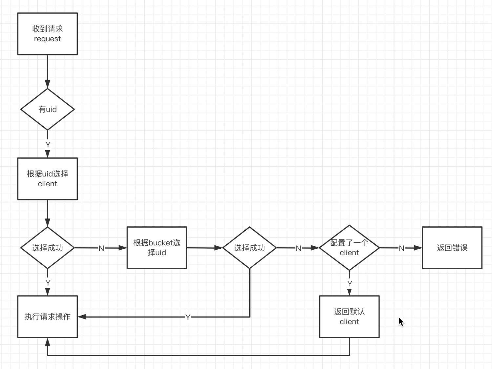

# Layotto对象存储（OSS）并集API接口定义及设计

## 背景

为了让layotto支持对象存储能力，需要对oss的接口进行抽象。抽象出的接口需要满足理论上的”可移植性“以及让接口具有明确的语义。

## 接口设计

整个接口的设计将遵循以下原则：

1. **语义性，即抽象出的接口具有明确的语义。**
2. **功能完整性，即抽象出的接口需要尽可能满足不同oss的能力。**
3. **最大可移植性，即抽象出的接口需要尽最大可能的满足可移植性的要求。**

上述原则设计的时候考量的优先级从高到低。为了满足上述的要求，可能会存在以下问题：

1. 字段的冗余，入参和出参可能会存在对应特定厂商的字段。
2. 部分接口可能只在部分oss厂商上可以支持，即“最大可能移植性”。

## 配置模块设计

oss原始配置模块的字段抽象如下所示：

```go
// OssMetadata wraps the configuration of oss implementation
type OssMetadata struct {
	Buckets         []string `json:"buckets"` // contained buckets in this oss client
	Uid             string   `json:"uid"`     // specify the uid of oss client
	Endpoint        string   `json:"endpoint"`
	AccessKeyID     string   `json:"accessKeyID"`
	AccessKeySecret string   `json:"accessKeySecret"`
	Region          string   `json:"region"`
}
```

Endpoint、AccessKeyID、AccessKeySecret、Region是现有的oss都有的概念，本文主要解释buckets和uid字段的作用。

场景假设：

如果用户有多个oss实例，即需要layotto支持多个endpoint和region，需要怎么做？

如果使用传统的sdk编程，用户编程时使用方式如下：

```go
client1, err := oss.New(metadata.Endpoint1, metadata.AccessKeyID1, metadata.AccessKeySecret1)

client2, err := oss.New(metadata.Endpoint2, metadata.AccessKeyID2, metadata.AccessKeySecret2)

//将object1上传到endpoint1
client1.PutObject("object1")
//将object2上传到endpoint2
client2.PutObject("object2")

```

从上面的编程方式可以看出，使用sdk编程时，用户可以拿到client的句柄，然后通过client句柄控制将文件上传到某个目标endpoint。
但在Layotto中，用户往往是用同一个grpc client来进行服务调用。那么每次PutObject，GetObject等对象操作就需要用户指定文件操作的目标,
即文件操作的endpoint。

配置文件中的buckets和uid字段就是用来指定client。如下图所示：


client选择流程图如下所示：

