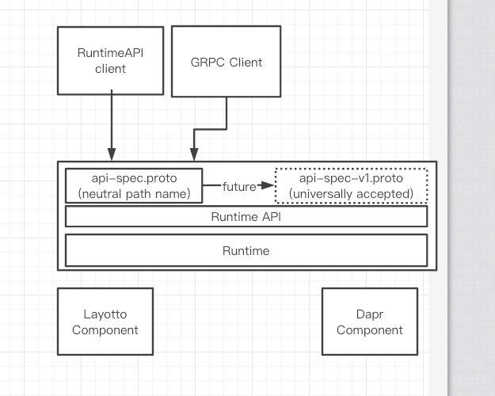
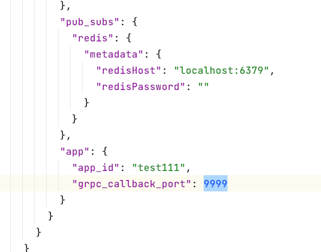

# Layotto Pub/Sub、兼容Dapr包方案
# 一、需求分析
1. 支持Pub/Sub API
2. 架构上尽量能复用Dapr的包

# 二、概要设计
## 2.1. 整体架构：是否复用Dapr的sdk和proto
为了将来能够和Dapr、Envoy社区共同制定一套API spec，当前尽量和Dapr API保持一致。

Dapr的组件库可以直接复用；下文讨论sdk和proto是否复用、怎么复用

### 面临的问题

1. dapr的sdk写死了调用接口的包名，名字里有dapr
   
2. 我们会有差异化的需求，比如新字段、新API，如果直接使用 dapr.proto会不灵活

### 方案

#### 不复用sdk和proto；把proto文件剥离，路径中立


我们自己先定义个api-spec.proto，这个proto是dapr API的超集，并且路径名中立、没有layotto字样，基于这个proto自己开发个中立的RuntimeAPI sdk。

后面尝试把proto推广成社区认可的api-spec，或者和其他社区一起重新建一个路径中立的api-spec.proto。

如果推广过程中proto有变也不要紧，Layotto内部在proto下面抽一层API层，防止proto变化；

如果不好推的话，短期我们可以先在中立sdk里写个dapr适配器，用我们的sdk既能调dapr又能用layotto：


优点：

1. 整洁。如果要复用Dapr的sdk和proto，有个不可避免的问题：当API和dapr不一样的时候，需要自己封装一层做自己的逻辑，这会带来复杂度、hacky、山寨感、提高代码阅读门槛
1. API和Dapr不一样的时候好扩展

缺点：

1. 后续Dapr client或者proto改了，我们可能不知道，导致不一致


## 2.2. API Design
### 2.2.1. 设计原则：想给Dapr API新增字段时如何处理
我们要复用Dapr API，但是长期来看肯定会有定制需求。当我们的API和dapr不一样的时候（比如只是想给Dapr的某个API新加个字段），是新开个方法名，还是在原来的方法上加个字段?
如果在原来的方法上加个字段，可能导致字段冲突。

有以下几种思路：

#### A. 只要API做变更、和Dapr不一样，就新开个方法名


新开方法名后，新老方法都得支持。**比如v1版是Dapr API版，v2版是扩展版本**

缺点：

1. 要支持两套API

#### B. 新加字段还用老方法名，但是跳几个数字、留白

缺点：

1. 留白意义不大？假如Dapr后来加上了这字段、但是数字不一样，我们就很难办(比如我们定义为10，dapr随后定义为5，那我们是有一个字段同时占着5和10？）
1. 假如Dapr加上了一个语义类似、但是有细微不同的字段，我们也很难办：这个字段我们加不加？


#### C. 加字段就直接加，不留白，冲突就冲突了（当然会尽量给Dapr社区提issue）
以后大家真的坐到一起达成共识、要做api-spec的时候，会新起个路径的proto，反正到时候有新proto，不用担心现在的冲突


#### 结论
讨论决定采用C的思路做

### 2.2.2. Between APP and Layotto
用和Dapr一样的grpc API

```protobuf
service AppCallback {
  // Lists all topics subscribed by this app.
  rpc ListTopicSubscriptions(google.protobuf.Empty) returns (ListTopicSubscriptionsResponse) {}

  // Subscribes events from Pubsub
  rpc OnTopicEvent(TopicEventRequest) returns (TopicEventResponse) {}

}
```

```protobuf
service Dapr {
  // Publishes events to the specific topic.
  rpc PublishEvent(PublishEventRequest) returns (google.protobuf.Empty) {}
}

```

### 2.2.3. Between Layotto and Component
用和Dapr一样的；
PublishRequest.Data和NewMessage.Data里面放符合CloudEvent 1.0规范的json数据（能反序列化放进map[string]interface{} ）

```go
// PubSub is the interface for message buses
type PubSub interface {
	Init(metadata Metadata) error
	Features() []Feature
	Publish(req *PublishRequest) error
	Subscribe(req SubscribeRequest, handler func(msg *NewMessage) error) error
	Close() error
}

// PublishRequest is the request to publish a message
type PublishRequest struct {
	Data       []byte            `json:"data"`
	PubsubName string            `json:"pubsubname"`
	Topic      string            `json:"topic"`
	Metadata   map[string]string `json:"metadata"`
}


// NewMessage is an event arriving from a message bus instance
type NewMessage struct {
	Data     []byte            `json:"data"`
	Topic    string            `json:"topic"`
	Metadata map[string]string `json:"metadata"`
}

```

### 2.2.4. sidecar怎么知道回调哪个端口

参考Dapr，启动时配置回调端口。代价是sidecar只能服务一个进程。

本期暂时选择此方案

### 2.2.5. 怎么保持订阅topic列表的实时性

sidecar启动时调用app，一次性获取订阅关系。因此对启动顺序有要求，先启动app。

后续可以优化成定时轮询app

### 2.2.6. 订阅关系是否支持声明式配置

一期先只支持开接口callback的形式，后续再优化加上声明式配置

## 2.3. Config Design


现在的app相关配置是放组件里的，后面要提出来、重构下Configuration API等代码（见下）。

**Q: 怎么把配置数据传给Dapr组件和Layotto组件**

A: 把metadata里的数据通过Init接口透传给组件

# 三、Future Work
## A Bigger Control Plane

Service Mesh时代的Control Plane只服务RPC，但Runtime API时代，组件配置也需要集群下发；组件也需要服务发现、路由，因此组件也需要有自己的Control Plane。

最好能有一个整合RPC和所有中间件配置数据的Bigger Control Plane

也许需要扩展xDS协议，比如runtime Discovery Service

## 订阅关系支持配置

订阅关系现在是靠回调app获取，可以加上通过配置的方式获取订阅关系

## appcallback 支持tls


## 分离组件配置和个性配置(回调端口,app-id)
目前组件配置和app个性配置(回调端口,app-id)放在一起，有以下问题：

1. 不好做集群配置下发
1. 没法做组件权限管控配置(比如Dapr能限制app-id1只能访问topic_id1）


需要重构下原先组件逻辑

## Tracing
