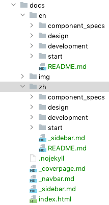
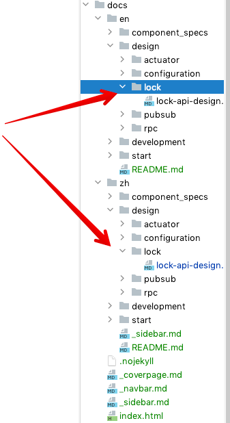

# 文档贡献指南

感谢您对Layotto的支持！

本文档描述了如何修改/新增文档。本仓库的文档使用Markdown语法编写。

## 1. 文档路径说明

文档统一放在docs/目录下，其中docs/en存放英文文档，docs/zh存放中文文档。



## 2. 文档站点说明
docs/目录下的文件，会被自动部署到github pages，通过[docsify](https://docsify.js.org/#/) 渲染。

通常来说，.md文件合并入主干分支后，您就能在Layotto的文档站点上看到新页面，部署、渲染的过程都是自动的。

### 本地启动文档站点
在本地写完文档后，为了能尽快查看效果，您也可以参考 [docsify quickstart](https://docsify.js.org/#/quickstart) 在本地启动文档站点。 

这里概括一下步骤：

step 1. 安装 docsify

```shell
npm i docsify-cli -g
```

step 2. 启动文档站点

```shell
# 在 layotto 项目根目录下执行
docsify serve docs
```

step 3. 打开 http://localhost:3000/  查看文档站点。

## 3. 新增文档需要做哪些事
### step 1. 新建 markdown 文档
当需要新增文档时，可以按目录结构新建文件夹、新建.md文件。比如想写分布式锁API的设计文档，就新建目录：



### step 2. 把文档加入侧边栏
新增文档、写完内容后，记得更新一下侧边栏哦。

中文侧边栏在 docs/zh/_sidebar.md

英文侧边栏在 docs/_sidebar.md

### step 3. (可选) 本地启动文档站点、验证
您可以使用 dosify 在本地启动文档服务器，查看修改效果 

### step 4. 提交pr、合并入代码库
写完上述markdown文件，提交pr、合并入主干分支后，打开官网就能看到新的文档啦

## 4. 经常遇到的坑：文档内的超链接

使用Docsify建站有个讨厌的问题：超链接很奇怪。

这里说的超链接是那种点了后会跳转到其他文档的链接，比如下面这种：


### 4.1. 错误的写法
如果你尝试用相对路径写超链接url，会发现在站点里点击他就会404：


### 4.2. 正确的写法

有两种正确的方式使用超链接：

a. 用相对于docs/目录的相对路径。例如：


b. 用完整的Url。例如：

```markdown
see [runtime_config.json](https://github.com/mosn/layotto/blob/main/configs/runtime_config.json):
```

## 5. 图片目录与图片链接
图片放在docs/img/ 目录下。放这里是为了能让docsify站点能访问到：


文档中引用图片建议就用完整路径，免得遇到一堆乱七八糟的路径问题。

例如，如果是引用main分支的图片，图片Url的前缀是`raw.githubusercontent.com/mosn/layotto/main/docs/img/xxx`

Markdown写法如下：

```markdown

```

注：相对路径其实也可以用，只不过你可能会遇到很多问题，比如``标签和markdown的相对路径逻辑不一样；比如用户可能会通过不同路径访问README，等等。总之很痛苦。