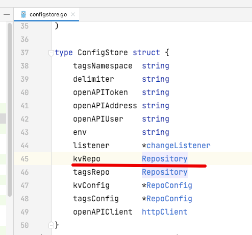
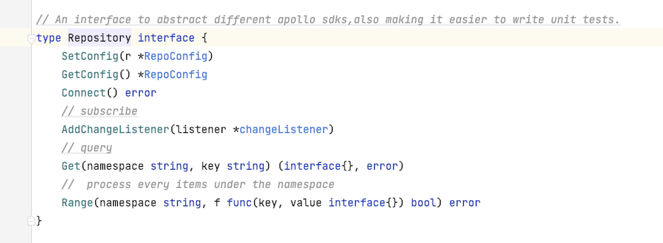
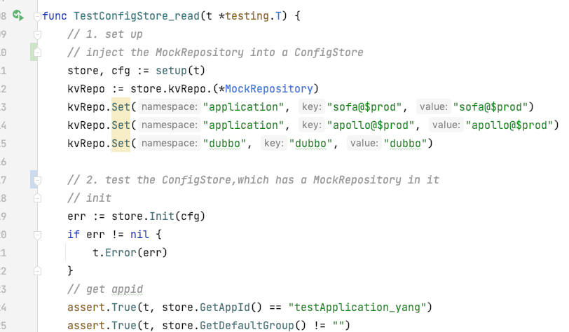
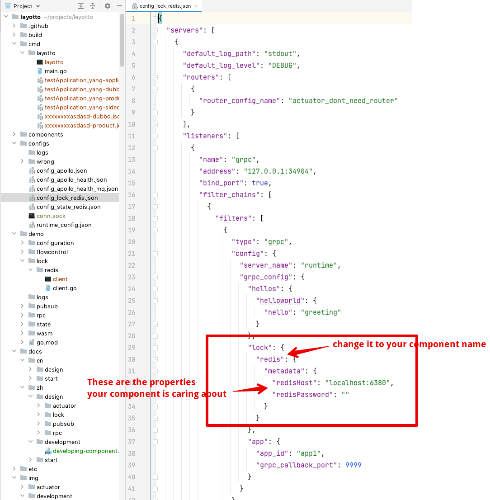
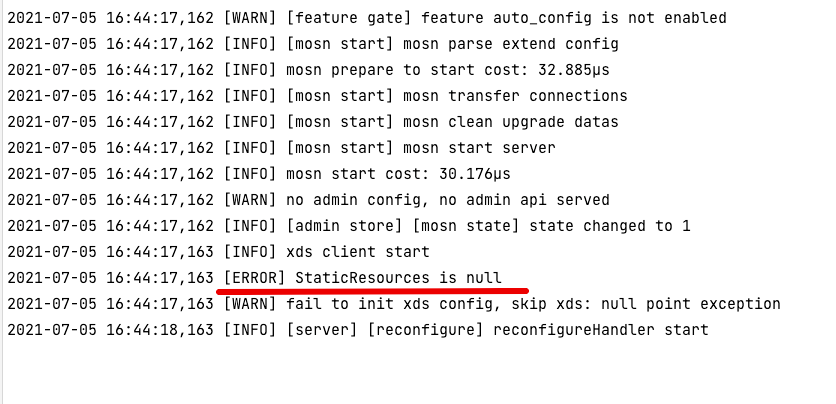

# 组件开发指南

感谢您对Layotto的支持！

本文档描述了如何开发Layotto组件。Layotto组件用Go语言编写，如果您对Go语言不熟悉可以看下[Go教程](https://tour.golang.org/welcome/1) 。

在开发新组件的时候，可以参考已有的其他组件。比如您想用zookeeper实现分布式锁API的话，可以参考分布式锁API已有的实现（例如redis的实现）以及分布式锁API的demo、设计文档，这会让开发简单很多。

## 一、准备工作

1. git clone下载代码到您喜欢的目录
2. 使用Docker启动您需要的环境。比如您想用zookeeper开发分布式锁API，就需要本地用Docker启动一个zookeeper容器，用于本地测试。
   
如果您本地没有Docker也不用害怕，可以参照 [Docker Desktop教程](https://www.runoob.com/docker/windows-docker-install.html) 装一个Docker Desktop,Mac和Windows都可以，用起来特别简单。

## 二、开发组件和单元测试
### 2.1. 在components/api名 目录下新建文件夹，开发您的组件

文件夹名用组件名就行，比如redis的组件如下图


开发过程中可能用到的工具类（不是强制一定要用哈，列在这只是供参考，希望能简化开发）：

- 如果组件里启动新协程，新协程里panic会导致整个server都panic宕掉，很危险，所以一般go func起新协程后都会先写defer recover相关的逻辑，如果懒得自己写可以直接用封装好的工具类 utils.GoWithRecover ，在mosn.io/pkg/utils/goroutine.go里

- 日志工具类常用log.DefaultLogger,在mosn.io/pkg/log/errorlog.go里

- 其他：Layotto的pkg/common目录下有一些工具类，以及mosn.io/pkg下也有很多工具类

### 2.2. 复制粘贴别的组件
   
简单起见，可以直接复制粘贴别的组件过来，修改开发。比如想用zookeeper实现分布式锁API的话，可以把redis组件复制粘贴过来改

### 2.3. 记得编写单元测试哦！
#### 2.3.1. 单元测试的注意事项
单测会在各种环境跑（比如每次有人提交代码后就会在github action提供的docker容器里跑，比如在别的开发者的电脑里跑），所以得保证他们能正常跑通过。需要考虑以下问题：
- 别人的环境里可能没提前装zookeeper，所以大家在写单测的时候，要么把网络调用的代码给mock掉（比如把调zookeeper的那部分代码在单测里mock掉），要么就会在单测里起一个简易版的zookeeper（比如redis的单测里，会起一个mini-redis)这样来保证别人跑单测的时候都能跑通过~

- 因为每次有人提交代码都会自动跑单元测试、跑通过才能合并，所以在单元测试里应尽量避免sleep太久（睡太久会导致单测跑的特别慢）

#### 2.3.2. 如何在单元测试中mock掉依赖的环境？（比如mock zookeeper或者mock redis)

一般是把所有网络调用的代码封装成一个interface，然后在ut中mock掉这个interface。以apollo配置中心的单元测试为例，见components/configstores/apollo/configstore.go 和 components/configstores/apollo/configstore_test.go ：

首先，在configstore.go里，把所有调sdk、发起网络调用调apollo的地方给封装成一个interface 




然后，把你代码中调sdk、做网络调用的代码封装成一个struct、实现刚才的interface：


做了这一步重构后，你的代码就有可测性了（这也是"测试驱动开发"思想的一种体现，为了让代码可测性好，把代码重构成可以依赖注入的形式）

接下来，写ut的时候，可以mock刚才的interface：


把mock后的东西注入到要测的struct里就行,然后测那个struct就行



注：一般“集成测试”的时候，会真正做网络调用、调一个正常的zookeeper或者redis；而单测注重测局部逻辑，不会调真实环境


## 三、在Layotto启动时注册组件
按照上述步骤只是开发出了组件，Layotto启动的时候并不会自动加载这个组件。

那么应该怎么让Layotto在启动的时候加载这个组件呢？

需要在cmd/layotto/main.go里集成进新的组件，包括：
### 3.1. 在main.go里import你的组件


### 3.2. 在main.go的NewRuntimeGrpcServer函数中注册你的组件


之后，用户如果在Layotto配置文件中配置了"我要用zookeeper"，那么Layotto就会初始化zookeeper组件

## 四、新增demo，用于集成测试
上面其实完成了开发，但是我们要让整个流程跑起来、测一测，于是就要加一个集成测试的demo

### 4.1. 新增一个示例配置文件

如上文所说：
>用户如果在Layotto配置文件中配置了"我要用zookeeper"，那么Layotto就会初始化zookeeper组件

那么用户怎么配"我要用zookeeper"呢？ 我们需要给一个示例配置，一方面供用户参考，一方面拿来跑集成测试

可以复制一份别的组件的json配置文件，例如开发分布式锁组件的时候，复制configs/config_redis.json，粘贴成configs/config_zookeeper.json

之后编辑修改一下图中的配置：




### 4.2. 新增客户端demo
我们需要一个客户端demo，比如分布式锁的客户端demo有两个协程并发调Layotto抢锁、只有一个能抢到

#### a. 如果该组件有通用客户端，就不用开发啦
如果demo目录下有common文件夹，代表这是个通用demo、能给不同的组件用，可以通过命令行传参传storeName，有这个就不用再开发demo啦


#### b. 如果该组件没有通用客户端，或者需要定制一些metadata传参，那就复制粘贴改一改
比如zookeeper实现分布式锁，有一些定制配置，所以想自己新写个demo，那就复制粘贴redis的demo、改一改


注：demo的代码里如果出现不该有的错误，可以直接panic。后续我们会直接用demo跑集成测试，如果panic了代表集成测试没有通过。
例如demo/lock/redis/client.go 里：

```go
    //....
	cli, err := client.NewClient()
	if err != nil {
		panic(err)
	}
    //....
```

### 4.3. 参照quickstart文档，启动Layotto和demo看看有没有报错
比如参考[分布式锁API的quickstart文档](zh/start/lock/start.md) ，启动你依赖的环境（比如zookeeper）、启动Layotto（记得用你刚才新增的配置文件！），看看有没有报错。

注：下面这个Error没事，无视就好



启动demo、调用Layotto，看看有没有报错。如果是通用客户端，可以在命令行命令里带上-s storeName传入storeName 


没有报错的话说明测试通过！

## 五、新增组件说明文档
以上就算完成了代码工作，最好能新增组件的配置说明文档，说明一下这个组件支持哪些配置项、怎么启动该组件依赖的环境（比如用docker怎么启动zookeeper)

可以参考 [lock API的redis组件说明(中文)](zh/component_specs/lock/redis.md)
和
[lock API的redis组件说明(英文)](en/component_specs/lock/redis.md),同样可以复制粘贴改一改。

