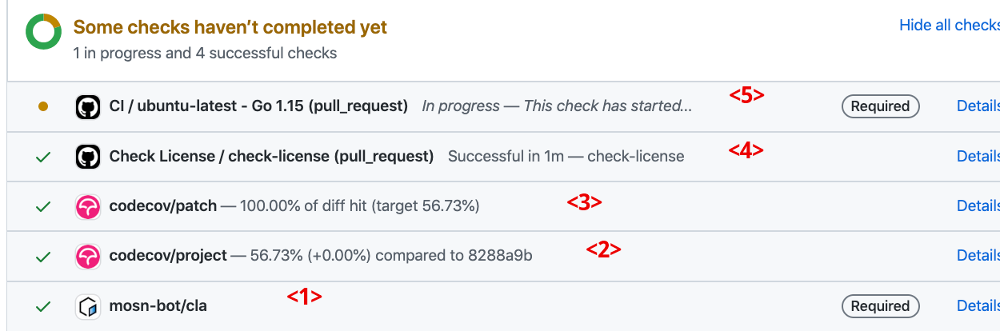
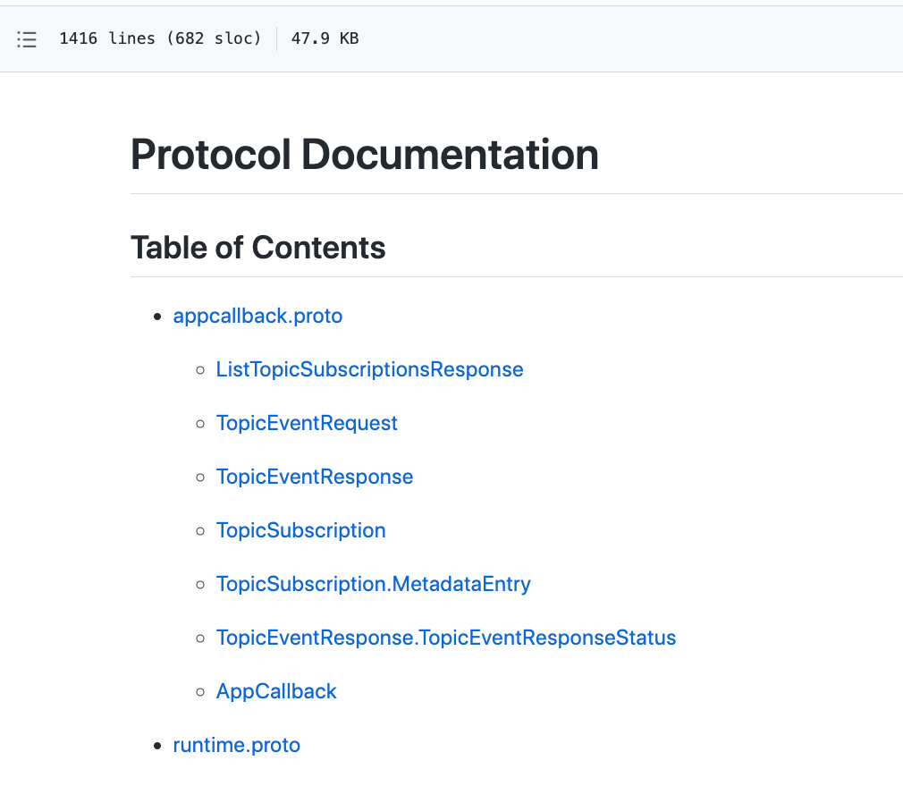

This document explain each component of Layotto's github workflow.

Note: configuration files of Layotto github workflow are [here](https://github.com/mosn/layotto/tree/main/.github/workflows)

## 1. Cron jobs
### stale bot 

  
We use [Close Stale Issues](https://github.com/marketplace/actions/close-stale-issues) .

An issue or PR will be automatically marked as stale if it has not had recent activity in the last 30 days. It will be closed in the next 7 days unless it is tagged (pinned, security, good first issue or help wanted) or other activity occurs.  

**If a community task issue was closed by this bot,then the task can be assigned to others.**  

Merged in https://github.com/mosn/layotto/pull/246

## 2. CI/CD

### 2.1. Chore
#### <1> cla bot

check if the contributor has signed cla

#### TODO: Automatically generate new API reference when proto files are modified

Currently [we have to do it manually](https://mosn.io/layotto/#/en/api_reference/how_to_generate_api_doc) .

The generated document is [here](https://github.com/mosn/layotto/blob/main/docs/en/api_reference/api_reference_v1.md)



### 2.2. Test
#### <5> Run unit tests
#### <5> Check if you have done `go fmt`  
#### <2><3> Make sure ut coverage ratio won't decrease

See https://docs.codecov.com/docs/commit-status#branches

#### TODO: Integration tests
  

### 2.3. Lint
#### <4> License checker
We use https://github.com/marketplace/actions/license-eye

Merged in https://github.com/mosn/layotto/pull/247

##### How to add license headers for all files automatically?
In Layotto directory:

```shell
docker run -it --rm -v $(pwd):/github/workspace apache/skywalking-eyes header fix
```

It will add license headers for code files recursively.

##### How to configurate the License checker to ignore files of specified types?
The ignore list is in `.licenserc.yaml`. You can add new types into it.

##### For more details of this tool
See https://github.com/marketplace/actions/license-eye#docker-image for details

#### TODO: PR title lint
~~#### TODO: PR body lint?~~
#### TODO: Code style lint
For example,find out `go xxx()` without `recover`
We can use go lint and refer to MOSN's configuration  

####  ~~- Commit message lint~~ (reverted)
see https://github.com/mosn/layotto/issues/243