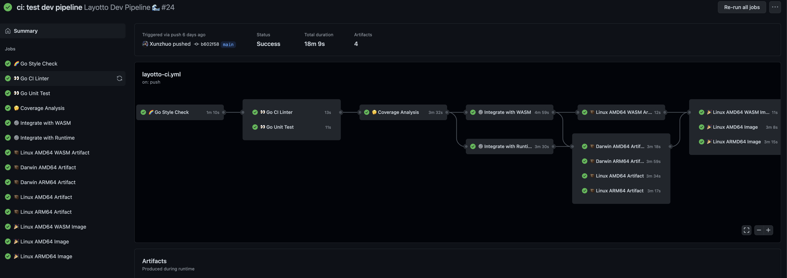
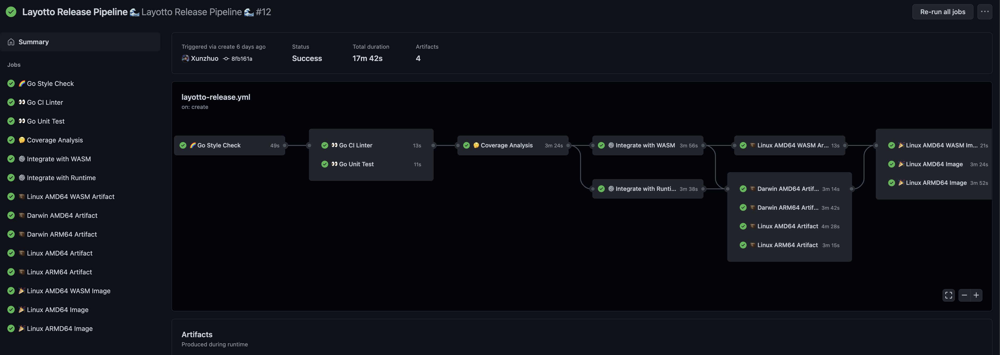

# Layotto GitHub Workflows

本文档解释了 Layotto 的 Github 四大工作流：
+ Layotto Env Pipeline 🌊
+ Layotto Dev Pipeline 🌊 (Before Merged)
+ Layotto Dev Pipeline 🌊 (After Merged)
+ Layotto Release Pipeline 🌊

工作流中包含了一个或多个任务，提高了 Layotto 的代码规范度和安全性，简化了开发/构建/发布等重复步骤，以下为对上述四大工作流的详细解释。

## Layotto Env Pipeline 🌊

### Job 任务内容

Layotto Env Pipeline 流水线主要负责 Layotto 的项目以及相关环境的规范，其中目前包含以下任务：
+ Title Validation (基于 Semantic 风格 检查 PR Title 的规范)
+ Quickstart Validation (QuickStart 文档的校验)
+ Update Stale Status (Issue/PR 状态的更新)
+ License Validation (License 的校验)
+ DeadLink Validation (文档中 DeadLink 的检查)
+ CodeQL (CodeQL 的分析)

### Job 触发方式

Layotto Env Pipeline 流水线任务触发方式：
+ Title Validation: 
  
    ```
    pull_request:
        types:
        - opened 开启 PR 
        - edited 编辑 PR
        - synchronize 同步 PR
        - labeled PR 添加 Label
        - unlabeled PR 取消 Label
    ```
  
+ Quickstart Validation: 
  
    ```
    push:
        branches:
        - main 合并 PR
    pull_request:
        branches:
        - main 提交 PR
    ```
  
+ Update Stale Status: 
  
    ```
    on:
    schedule:
        - cron: '30 1 * * *' 定时任务
    ```
  
+ License Validation: 
  
    ```
    push:
        branches:
        - main 合并 PR
    pull_request:
        branches:
        - main 提交 PR
    ```
  
+ DeadLink Validation: 
  
    ```
    pull_request:
        branches:
        - main 提交 PR
    ```
  
+ CodeQL: 
  
    ```
    schedule:
        - cron: '0 4 * * 5' 定时任务
    ```

## Layotto Dev Pipeline 🌊 (Before Merged)


### Job 任务内容

Layotto Dev Pipeline (Before Merged) 流水线主要负责 Layotto 提交 PR 后对代码的校验，其中目前包含以下若干任务：

+ Go Style Check：对代码进行 风格校验
+ Go CI Linter：对代码进行 Linter 规范校验
+ Go Unit Test 对代码进行 单元测试
+ Coverage Analysis 对代码进行 Coverage 分析
+ Integrate with WASM 对代码进行 WASM 集成测试
+ Integrate with Runtime 对代码进行 Runtime 集成测试
+ Darwin AMD64 Artifact 对代码构建 Darwin AMD64 Binary 校验
+ Darwin ARM64 Artifact 对代码构建 Darwin ARM64 Binary 校验
+ Linux AMD64 Artifact 对代码构建 Linux AMD64Binary 校验
+ Linux ARM64 Artifact 对代码构建 Linux ARM64 Binary 校验
+ Linux AMD64 WASM Artifact 对 Layotto WASM 构建 Linux AMD64 Binary 校验

### Job 触发方式

```
    on:
    push:
        branches: [main] 合并 PR
        paths-ignore: 忽略以下变更： docs 目录下文件，markdown 文件
        - 'docs/**'
        - '**/*.md'
    pull_request:
        branches: "*" 提交 PR
        paths-ignore: 忽略以下变更： docs 目录下文件，markdown 文件
        - 'docs/**'
        - '**/*.md'
```

## Layotto Dev Pipeline 🌊 (After Merged)



### Job 任务内容

Layotto Dev Pipeline (After Merged) 流水线主要负责 Layotto 代码合并后的校验和发布，其中目前包含以下任务：

+ Go Style Check：对代码进行 风格校验
+ Go CI Linter：对代码进行 Linter 规范校验
+ Go Unit Test 对代码进行 单元测试
+ Coverage Analysis 对代码进行 Coverage 分析
+ Integrate with WASM 对代码进行 WASM 集成测试
+ Integrate with Runtime 对代码进行 Runtime 集成测试
+ Darwin AMD64 Artifact 对代码构建 Darwin AMD64 Binary 校验
+ Darwin ARM64 Artifact 对代码构建 Darwin ARM64 Binary 校验
+ Linux AMD64 Artifact 对代码构建 Linux AMD64Binary 校验
+ Linux ARM64 Artifact 对代码构建 Linux ARM64 Binary 校验
+ Linux AMD64 WASM Artifact 对 Layotto WASM 构建 Linux AMD64 Binary 校验
+ Linux AMD64 WASM Image 发布最新版本的 Layotto WASM 镜像，镜像规范为  layotto/faas-amd64:latest
+ Linux AMD64 Image  发布最新版本的 Layotto 镜像，镜像规范为 layotto/layotto:latest
+ Linux ARMD64 Image  发布最新版本的 Layotto 镜像，镜像规范为 layotto/layotto.arm64:latest

### Job 触发方式

```
    on:
    push:
        branches: [main] 合并 PR
        paths-ignore: 忽略以下变更： docs 目录下文件，markdown 文件
        - 'docs/**'
        - '**/*.md'
    pull_request:
        branches: "*" 提交 PR
        paths-ignore: 忽略以下变更： docs 目录下文件，markdown 文件
        - 'docs/**'
        - '**/*.md'
```

## Layotto Release Pipeline 🌊



### Job 任务内容

Layotto Release Pipeline 流水线主要负责 Layotto 新版本发布以及校验，其中目前包含以下任务：

+ Go Style Check：对代码进行 风格校验
+ Go CI Linter：对代码进行 Linter 规范校验
+ Go Unit Test 对代码进行 单元测试
+ Coverage Analysis 对代码进行 Coverage 分析
+ Integrate with WASM 对代码进行 WASM 集成测试
+ Integrate with Runtime 对代码进行 Runtime 集成测试
+ Darwin AMD64 Artifact 对代码构建 Darwin AMD64 Binary 校验
+ Darwin ARM64 Artifact 对代码构建 Darwin ARM64 Binary 校验
+ Linux AMD64 Artifact 对代码构建 Linux AMD64Binary 校验
+ Linux ARM64 Artifact 对代码构建 Linux ARM64 Binary 校验
+ Linux AMD64 WASM Artifact 对 Layotto WASM 构建 Linux AMD64 Binary 校验
+ Linux AMD64 WASM Image 发布 Release 版本的 Layotto WASM 镜像，镜像规范为  layotto/faas-amd64:{latest_tagname}
+ Linux AMD64 Image  发布 Release 版本的 Layotto 镜像，镜像规范为 layotto/layotto:{latest_tagname}
+ Linux ARMD64 Image  发布 Release 版本的 Layotto 镜像，镜像规范为 layotto/layotto.arm64:{latest_tagname}

### Job 触发方式

```
    on:
    create 创建 Tag 或 Branch，结合以下条件

    if: ${{ startsWith(github.ref, 'refs/tags/') }} 变更为 Tag（忽略新 Branch 的创建）
```

> Layotto 的 github 工作流的配置文件在[这里](https://github.com/mosn/layotto/tree/main/.github/workflows)

## 视频介绍
@Xunzhuo 在社区会议上介绍了新的 Workflow, 感兴趣可以观看会议录像。

录像从 5 分 58 秒开始，到 24 分 03 秒结束。

> [!TIP|label: 视频内容不一定是最新的]
> 视频是 2022-04-29 录制，可能录完视频后 workflow 又做了修改，因此最新情况以 workflow 文件和本文档为准.

<iframe src="//player.bilibili.com/player.html?high_quality=1&aid=546185355&bvid=BV1wY4y1b7a5&t=358.6&cid=357203402&page=1" width="100%" height="500" scrolling="no" border="0" frameborder="no" framespacing="0" allowfullscreen="true"> </iframe>