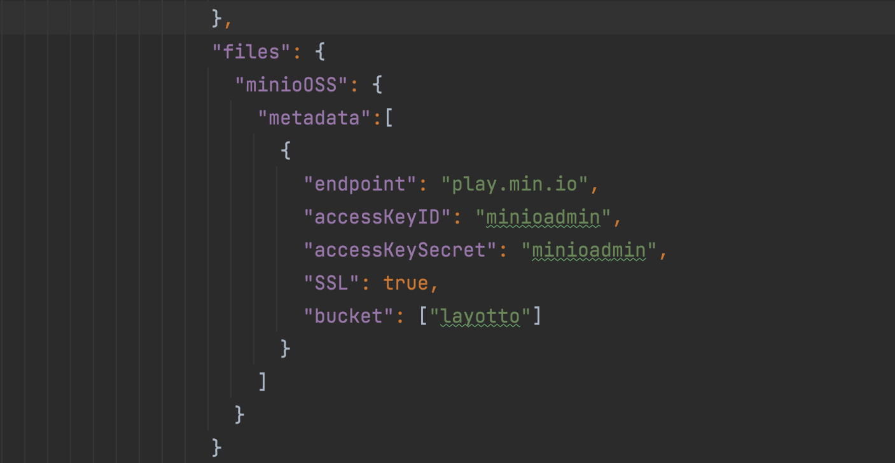

# 基于MinIO OSS实现文件的增删改查

## 快速开始

Layotto提供了访问文件的示例 [demo](../../../../demo/file/client.go),该示例实现了文件的增删改查操作。

### 第一步：启动layotto

layotto提供了minio的配置文件[oss配置](../../../../configs/config_file.json)，如下图所示



### 第二步：启动MinIO服务
访问[MinIO示例服务](play.min.io)

创建bucket，包含配置文件中的bucket

或者启动本地MinIO服务

参考[官方文档](http://docs.minio.org.cn/docs/master/minio-docker-quickstart-guide)
```
docker pull minio/minio
docker run -p 9000:9000 minio/minio server /data --console-address ":9000" --address ":9090"
```

### 第三步：启动测试demo

Layotto提供了访问文件的示例 [demo](../../../../demo/file/client.go)

```go

cd ${projectpath}/demo/file
go build client.go

./client bucket test //创建名为test的bucket
./client put test/hello/layotto.txt "hello layotto" //上传文件到test bucket，前缀为hello，内容为"hello layotto"
./client get test/hello/layotto.txt //获取 layotto.txt的内容
./client list test/hello // 获取test bucket下的前缀为hello的所有文件列表
./client stat test/hello/layotto.txt //获取layotto.txt文件的元数据
./client del test/hello/layotto.txt //删除layotto.txt文件

```
#### 细节以后再说，继续体验其他API
通过左侧的导航栏，继续体验别的API吧！

#### 了解File API的实现原理

如果您对实现原理感兴趣，或者想扩展一些功能，可以阅读[File API的设计文档](../../design/file/file-design.md)
