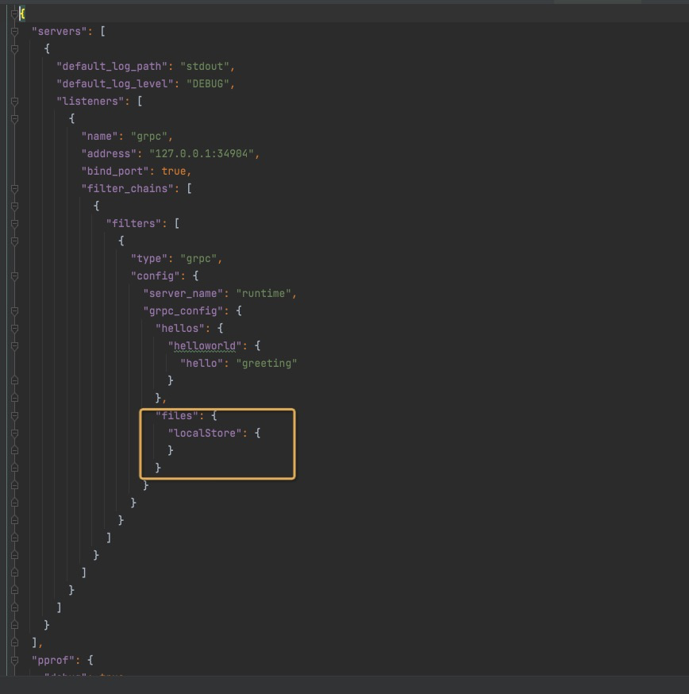

# 基于本地文件系统实现文件的增删改查

## 快速开始

Layotto提供了访问文件的示例 [demo](../../../../demo/file/client.go),该示例实现了文件的增删改查操作。

### 第一步：启动layotto

layotto提供了file的配置文件[file配置](../../../../configs/config_file.json)，如下图所示



下载layotto代码后，通过下面命令启动layotto:

```shell

cd ${projectpath}/cmd/layotto
go build
./layotto start -c ../../configs/config_file.json

```

### 第二步：启动测试demo

Layotto提供了访问文件的示例 [demo](../../../../demo/file/client.go)

```shell
cd ${projectpath}/demo/file
go build client.go //编译生成client可执行文件

```

#### 写文件：

```shell
./client put test.txt hello
```
会在${projectpath}/cmd/layotto目录下生成文件test.txt，文件内容为hello

#### 读文件：

```shell
./client get test.txt
```
输出：get file sucess, content is:  hello

#### 查询文件：

```shell
./client get ${projectpath}/cmd/layotto
```

输出：files under directory is: [layotto main.go text.txt] 

#### 删除文件
```shell
./client del text.txt 
```
输出：delete file success，这时候text.txt文件被删除。

#### 细节以后再说，继续体验其他API
通过左侧的导航栏，继续体验别的API吧！

#### 了解分布式锁 API的实现原理

如果您对实现原理感兴趣，或者想扩展一些功能，可以阅读[File API的设计文档](../../design/file/file-design.md)