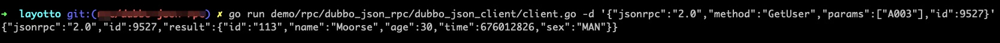

# Dubbo JSON RPC Example
*注意: 这个例子需要运行在go v1.17下*
## 快速开始
### step 1. 修改配置文件，加入`dubbo_json_rpc`插件


### step 2. 编译运行layotto

```shell @if.not.exist layotto
go build -o layotto ./cmd/layotto
```

```shell @background
./layotto -c demo/rpc/dubbo_json_rpc/example.json
```

### step 3. 启动dubbo服务端

这里使用了`dubbo-go-samples`提供的示例服务。
下载示例：

```shell @if.not.exist dubbo-go-samples
git clone https://github.com/apache/dubbo-go-samples.git
```

启动 zookeeper:

```shell
cd dubbo-go-samples
git reset --hard f0d1e1076397a4736de080ffb16cd0963c8c2f9d

# start zookeeper
cd rpc/jsonrpc/go-server
docker-compose -f docker/docker-compose.yml up -d

# prepare to build dubbo server
cd cmd
export DUBBO_GO_CONFIG_PATH="../conf/dubbogo.yml"
```

构建 dubbo server:

```shell @if.not.exist server
go build -o server .
```

运行 dubbo server:

```shell @background.sleep 3s
./server
```

### step 4. 通过GPRC接口发起调用

```shell @cd ${project_path}
go run demo/rpc/dubbo_json_rpc/dubbo_json_client/client.go -d '{"jsonrpc":"2.0","method":"GetUser","params":["A003"],"id":9527}'
```



### 下一步

如果您对实现原理感兴趣，或者想扩展一些功能，可以阅读[RPC的设计文档](zh/design/rpc/rpc设计文档.md)
