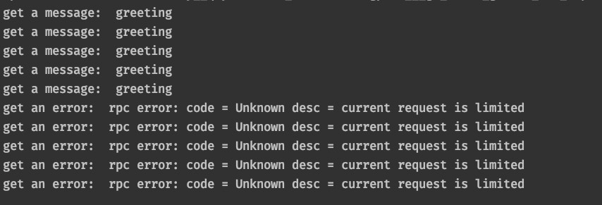

## 方法级别流量控制

### 功能介绍

在[runtime_config.json](https://github.com/mosn/layotto/blob/main/configs/runtime_config.json) 中，有一段关于限流的配置如下：

```json
[
    {
        "type": "flowControlFilter",
        "config": {
            "global_switch": true,
            "limit_key_type": "PATH",
            "rules": [
                {
                    "resource": "/runtime.proto.runtime.v1.MosnRuntime/SayHello",
                    "grade": 1,
                    "threshold": 5
                }
            ]
        }
    }
]
```

这段配置就是让`/spec.proto.runtime.v1.Runtime/SayHello`接口具备限流能力，1s只能调用5次。

对应的调用端代码在[client.go](https://github.com/mosn/layotto/blob/main/demo/flowcontrol/client.go) 中，代码逻辑很简单，就是想服务端发起10次调用，调用结果如下：



可以看到前5次请求正常，后5次请求被限流。

### 配置参数说明

限流配置：

| 字段名 | 字段类型 | 说明 |
|  ----  | ----  | ---- |
| global_switch  | boolean | 全局开关，是否开启限流 |
| limit_key_type  | String | 访问标识，目前为固定值PATH |
| rules  | Array | 限流规则 |

限流规则：

| 字段名 | 字段类型 | 说明 |
|  ----  | ----  | ---- |
| resource  | String | 限流资源标识，也就是要进行限流的方法 |
| grade  | int | 阈值更新时间，单位为秒 |
| threshold  | int | 阈值，超过就会被限流 |