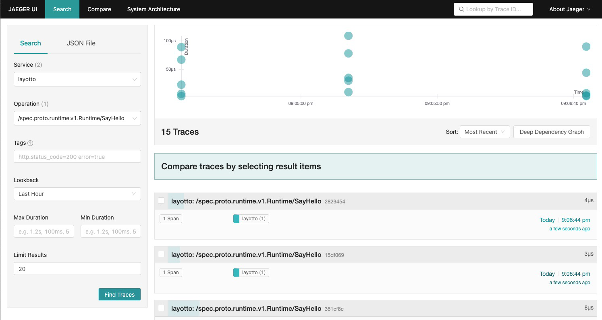

# Jaeger trace 接入

## 配置

示例：configs/config_trace_jaeger.json

```json
{
  "tracing": {
    "enable": true,
    "driver": "jaeger",
    "config": {
      "config": {
        "service_name": "layotto",
        "agent_host": "127.0.0.1:6831",
        "strategy": "collector"
      }
    }
  }
}
```

| 字段           | 必填  | 说明                 |
|--------------|-----|--------------------|
| service_name | Y | 服务名称               |
| agent_host   | N | agent组件端口          |
| strategy     | N | 数据上报方式，默认使用agent方式 |

## 运行Jaeger

```shell
cd ${project_path}/diagnostics/jaeger

docker-compose -f jaeger-docker-compose.yaml up -d
```

## 运行layotto

可以按照如下方式启动一个layotto的server：

切换目录:

```shell
cd ${project_path}/cmd/layotto_multiple_api
```

构建:

```shell @if.not.exist layotto
go build -o layotto
```

运行:

```shell @background
./layotto start -c ../../configs/config_trace_jaeger.json 
```

## 运行 Demo

对应的调用端代码在[client.go](https://github.com/mosn/layotto/blob/main/demo/flowcontrol/client.go) 中，运行它会调用layotto的SayHello接口：

切换目录:

```shell
 cd ${project_path}/demo/flowcontrol/
``` 

构建:

```shell @if.not.exist client 
 go build -o client
```
运行:

```shell
./client
```

访问 http://localhost:16686




## 清理资源

```shell
cd ${project_path}/diagnostics/jaeger

docker-compose -f jaeger-docker-compose.yaml down
```