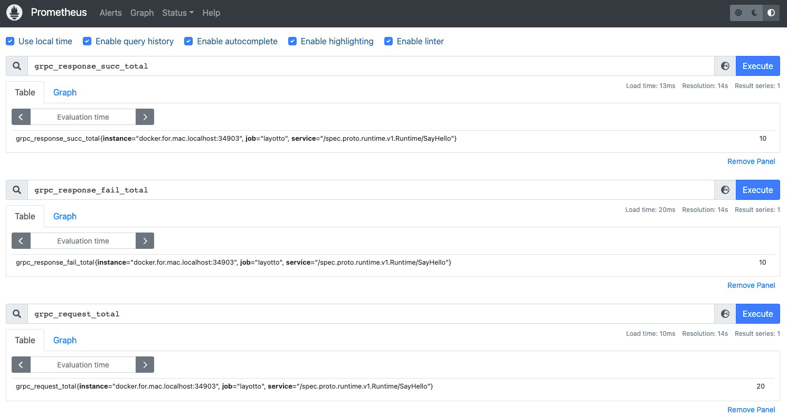

# Prometheus metrics 接入

## 运行prometheus

window用户需要将prometheus.yml中的layotto改成'docker.for.windows.localhost:34903'


```shell
cd ${project_path}/demo/prometheus

docker-compose -f prometheus-docker-compose.yaml up -d
```

## 运行layotto

可以按照如下方式启动一个layotto的server：

```shell
cd ${project_path}/cmd/layotto
go build -o layotto
./layotto start -c ../../configs/runtime_config.json
```

## 运行 Demo

对应的调用端代码在[client.go](https://github.com/mosn/layotto/blob/main/demo/flowcontrol/client.go) 中，运行它会调用layotto的SayHello接口：

```shell
 cd ${project_path}/demo/flowcontrol/
 go build -o client
 ./client
```
访问 http://127.0.0.1:9090/graph?g0.expr=grpc_request_total




## 清理资源

````shell
cd ${project_path}/demo/prometheus

docker-compose -f prometheus-docker-compose.yaml down
````