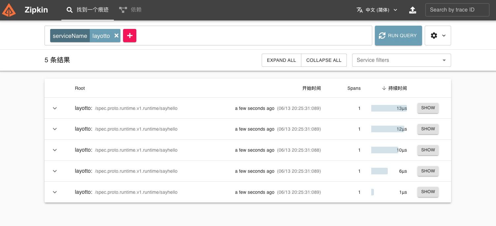

# ZipKin trace 接入

## 配置

示例：configs/config_trace_zipkin.json

```json
{
  "tracing": {
    "enable": true,
    "driver": "Zipkin",
    "config": {
      "config": {
        "config": {
          "service_name": "layotto",
          "reporter_endpoint": "http://127.0.0.1:9411/api/v2/spans",
          "recorder_host_post": "127.0.0.1:9000"
        }
      }
    }
  }
}

```
| 字段   | 必填  | 说明                                           |
|------|-----|----------------------------------------------|
| service_name | Y   | 服务名称，默认为layotto                              |
| reporter_endpoint | Y   | 链路日志输出，默认为http://127.0.0.1:9411/api/v2/spans |
| recorder_host_post     | Y   | 当前服务端口号，默认为127.0.0.1:9000                                  |


## 运行ZipKin

```shell
cd ${project_path}/diagnostics/zipkin

docker-compose -f zipkin-docker-compose.yaml up -d
```

## 运行layotto

可以按照如下方式启动一个layotto的server：

切换目录:

```shell
cd ${project_path}/cmd/layotto_multiple_api
```

构建:

```shell @if.not.exist layotto
go build -o layotto
```

运行:

```shell @background
./layotto start -c ../../configs/config_trace_zipkin.json 
```

## 运行 Demo

对应的调用端代码在[client.go](https://github.com/mosn/layotto/blob/main/demo/flowcontrol/client.go) 中，运行它会调用layotto的SayHello接口：

切换目录:

```shell
 cd ${project_path}/demo/flowcontrol/
``` 

构建:

```shell @if.not.exist client 
 go build -o client
```
运行:

```shell
./client
```
访问：http://localhost:9411/zipkin/?serviceName=layotto&lookback=15m&endTs=1655559536414&limit=10



## 清理资源

```shell
cd ${project_path}/diagnostics/zipkin

docker-compose -f zipkin-docker-compose.yaml down
```