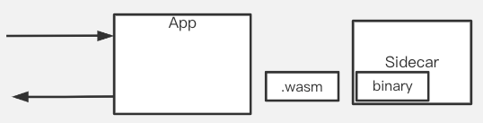

## 将业务逻辑通过WASM下沉进sidecar
### 功能介绍
service mesh 和 multi-runtime 的 sidecar 是全公司通用的基础设施，但实践中,业务系统也会有自己的sdk，也会有推动用户升级难、版本碎片的问题.

比如某中台系统以jar包形式开发了sdk，供上层业务系统使用。他们的feature不算全公司通用，因此没法说服中间件团队、开发到公司统一的sidecar里。


而如果变成这样：



如果开发者不再开发sdk(jar包），改成开发.wasm文件、支持独立升级部署，就没有推动业务方升级的痛苦了,想要升级的时候在运维平台上操作发布即可，不需要app和sidecar重启

Layotto支持加载编译好的WASM文件，并通过`proxy_abi_version_0_2_0`版本的API与目标WASM进行交互。

### 快速开始

#### step 1. 启动redis并写入测试数据

这里只是需要一个可以正常使用 Redis 即可，至于 Redis 安装在哪里没有特别限制，可以是虚拟机里，也可以是本机或者服务器。

这里以用 Docker 安装 Redis 为例，进行介绍。

启动 Redis 容器:

```shell
docker run -d --name redis-test -p 6379:6379 redis
```

调用 Redis 容器中的 redis-cli,执行`set book1 100`

```shell
docker exec -i redis-test redis-cli set book1 100
```

这条命令将 key 为 `book1` 的缓存值设置为100。如果返回如下结果,代表 set 成功:

```bash
OK
```

我们可以执行 `get book1`,看看现在 `book1` 对应的值是多少:

```shell
docker exec -i redis-test redis-cli get book1
```

返回:

```bash
"100"
```

符合预期

#### step 2. 启动layotto

构建:

```shell @if.not.exist layotto_wasmtime
go build -tags wasmcomm,wasmtime -o ./layotto_wasmtime ./cmd/layotto
```

如果你想使用 wasmer 作为 WebAssembly 运行时, 可以修改 build 指令为: `go build -tags wasmcomm,wasmer -o ./layotto_wasmtime ./cmd/layotto`

运行:

```shell @background
./layotto_wasmtime start -c ./demo/faas/config.json
```

**注：需要把`./demo/faas/config.json`中的 redis 地址修改为实际地址，默认地址为：localhost:6379。**

#### step 3. 发送请求

```shell
curl -H 'id:id_1' 'localhost:2045?name=book1'
```

将返回如下结果:

```bash
There are 100 inventories for book1.
```

该http请求会访问 Layotto 中的wasm模块。该wasm模块会调用redis进行逻辑处理

#### step 4. 销毁容器，释放资源

```shell
docker rm -f redis-test
```

### 动态注册

除了在 `./demo/faas/config.json` 中指定要加载的 WASM 文件外（比如以下配置）：

```json
"config": {
  "function1": {
    "name": "function1",
    "instance_num": 1,
    "vm_config": {
      "engine": "wasmtime",
      "path": "demo/faas/code/golang/client/function_1.wasm"
    }
  },
  "function2": {
    "name": "function2",
    "instance_num": 1,
    "vm_config": {
      "engine": "wasmtime",
      "path": "demo/faas/code/golang/server/function_2.wasm"
    }
  }
}
```

提示：我们还支持将 wasmer 作为 vm_config 中的 engine 的值。

我们也可通过以下接口来动态的卸载、加载、更新WASM 文件（由于示例启动时已经默认从配置文件中加载，故此处先卸载再加载）。

#### 卸载

```shell
curl -H "Accept: application/json" -H "Content-type: application/json" -X POST -d '{"name":"id_1"}' http://127.0.0.1:34998/wasm/uninstall
```

#### 加载

```shell
curl -H "Accept: application/json" -H "Content-type: application/json" -X POST -d '{"name":"id_1","instance_num":1,"vm_config":{"engine":"wasmtime","path":"demo/faas/code/golang/client/function_1.wasm"}}' http://127.0.0.1:34998/wasm/install
```

#### 更新实例数

```shell
curl -H "Accept: application/json" -H "Content-type: application/json" -X POST -d '{"name":"id_1","instance_num":2}' http://127.0.0.1:34998/wasm/update
```

### 说明

该功能目前仍处于试验阶段，社区里对于WASM跟宿主的交互API也不够统一，因此如果您有该模块的需求欢迎发表在issue区，我们一起建设WASM！