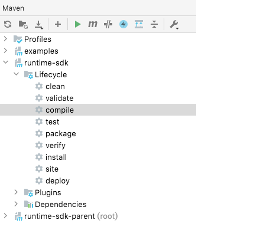

## 如何使用java sdk
### 1. import sdk
对于 Maven 项目，将以下配置添加进 `pom.xml` 文件:
```xml
<project>
  ...
  <dependencies>
    ...
    <dependency>
        <groupId>io.mosn.layotto</groupId>
        <artifactId>runtime-sdk-parent</artifactId>
        <version>1.0.0</version>
    </dependency>
    ...
  </dependencies>
  ...
</project>
```

### 2. 运行 examples 示例
可以本地部署redis和Layotto，然后运行java应用示例，通过java sdk调Layotto，Layotto转发给redis

#### 第一步：部署redis

1. 取最新版的 Redis 镜像。
   这里我们拉取官方的最新版本的镜像：

```shell
docker pull redis:latest
```

2. 查看本地镜像
   使用以下命令来查看是否已安装了 redis：

```shell
docker images
```

3. 运行容器

安装完成后，我们可以使用以下命令来运行 redis 容器：

```shell
docker run -itd --name redis-test -p 6380:6379 redis
```

参数说明：

-p 6380:6379：映射容器服务的 6379 端口到宿主机的 6380 端口。外部可以直接通过宿主机ip:6380 访问到 Redis 的服务。

#### 第二步：构建并运行Layotto

clone仓库到本地:

```sh
git clone https://github.com/mosn/layotto.git
```

构建并运行Layotto:

```bash
# make sure you replace this` ${projectpath}` with your own project path.
cd ${projectpath}/cmd/layotto
go build
./layotto start -c ../../configs/config_redis.json
```

构建java-sdk [Maven](https://maven.apache.org/install.html) (Apache Maven version 3.x) 项目:

```sh
# make sure you replace this` ${projectpath}` with your own project path.
cd ${projectpath}/sdk/java-sdk
mvn clean install
```

#### 第三步：运行java sdk示例
通过以下Examples示例来了解如何使用SDK:
* [Hello world](./examples/src/test/java/io/mosn/layotto/examples/helloworld)
* [State management](./examples/src/test/java/io/mosn/layotto/examples/state)
* [Pubsub API](./examples/src/test/java/io/mosn/layotto/examples/pubsub)
* [File API](./examples/src/test/java/io/mosn/layotto/examples/file)

## java sdk开发指南
### java sdk职责
1. sdk负责对Layotto的grpc API进行封装、不应该有任何中间件的定制逻辑，比如不应该出现redis、rocketmq等产品相关的逻辑。

2. sdk需要把所有跟通信协议相关的东西（比如proto编译出来的stub类）屏蔽掉，请勿让public方法暴露出任何跟协议相关的东西，最好protected方法也不暴露proto相关的东西。
   这么做是因为将来可能改grpc API的package路径，甚至哪天不用grpc了（谁知道呢）。总之请让用户不用关心协议。

举个例子, state API对应有个`deleteState`方法，需要传`DeleteStateRequest`对象。 
```java

    /**
     * Delete a state.
     *
     * @param request Request to delete a state.
     */
    void deleteState(DeleteStateRequest request);

```
这个`DeleteStateRequest`是sdk定义的，其实sdk会把它转成 `RuntimeProto.DeleteStateRequest` (proto编译出来的类) 。

你可能会问：为什么不能直接传`RuntimeProto.DeleteStateRequest` 呢？

这就是上面说的原因，sdk需要封装掉协议相关的东西

### 想为某个grpc API提供java sdk，需要做哪些事情？
举个例子，grpc API里添加了file API，现在想为java sdk开发file API相关功能，需要做哪些事情？

1. 先找个java sdk的demo跑起来，然后看懂java sdk是怎么创建对象、怎么调用的。其实java sdk就是把grpc包了一层，封装掉grpc的一些stub类，逻辑不多。

2. 参考pr [feat(java-sdk): java sdk support File API](https://github.com/mosn/layotto/pull/325) . 这个pr 给java sdk添加了file API相关功能

### 如何格式化 java sdk 代码
提交pull request之前先用maven编译一下

```shell
mvn clean compile
```
会自动格式化您的代码

### 如何将proto文件编译成java代码

#### 1. 下载编译工具 [protoc](https://github.com/protocolbuffers/protobuf/releases)
my protoc version:
```shell
$ protoc --version
libprotoc 3.11.2
```

#### 2. 修改对应`proto`文件生成类名包名等信息
(需先修改文件内部service名)
`spec/proto/runtime/v1/appcallback.proto` : 
```protobuf
option java_outer_classname = "AppCallbackProto";
option java_package = "spec.proto.runtime.v1";
```
`spec/proto/runtime/v1/runtime.proto` :
```protobuf
option java_outer_classname = "RuntimeProto";
option java_package = "spec.proto.runtime.v1";
```

#### 3. 编译其对应`JAVA`文件
```shell
cd ${your PROJECT path}/spec/proto/runtime/v1
protoc -I=. --java_out=../../../../sdk/java-sdk/sdk/src/main/java/  runtime.proto
protoc -I=. --java_out=../../../../sdk/java-sdk/sdk/src/main/java/  appcallback.proto
```

PS: 建议用maven插件`protoc-gen-grpc-java`生成protobuf和grpc的java代码

如果您在使用 [IntelliJ IDEA](https://www.jetbrains.com/help/idea/discover-intellij-idea.html) ,双击 Maven插件中的 `compile` ， IDE 会自动帮你编译 proto 文件:


