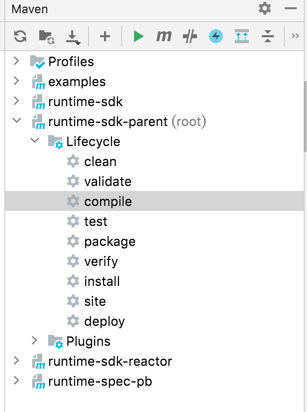

[中文](./README-zh.md)
## How to use java sdk
### 1. import sdk
For a Maven project, add the following to your `pom.xml` file:
```xml
<project>
  ...
  <dependencies>
    ...
    <dependency>
        <groupId>io.mosn.layotto</groupId>
        <artifactId>runtime-sdk-parent</artifactId>
        <version>1.0.0</version>
    </dependency>
    ...
  </dependencies>
  ...
</project>
```

### 2. Run the examples
Clone this repository including the submodules:

```sh
git clone https://github.com/mosn/layotto.git
```

Build and run Layotto:

```bash
# make sure you replace this` ${projectpath}` with your own project path.
cd ${projectpath}/cmd/layotto
go build
./layotto start -c ../../configs/config_redis.json
```

Then head over to build the java-sdk [Maven](https://maven.apache.org/install.html) (Apache Maven version 3.x) project:

```sh
# make sure you replace this` ${projectpath}` with your own project path.
cd ${projectpath}/sdk/java-sdk
mvn clean install
```


Try the following examples to learn more about this SDK:
* [Hello world](./examples/src/test/java/io/mosn/layotto/examples/helloworld)
* [State management](./examples/src/test/java/io/mosn/layotto/examples/state)
* [Pubsub API](./examples/src/test/java/io/mosn/layotto/examples/pubsub)
* [File API](./examples/src/test/java/io/mosn/layotto/examples/file)

## java sdk developer guide 
### How to format java sdk code
Compile before submit your pull request:

```shell
mvn clean compile
```
It will format your code automatically.

### How to generate a Java PROTO file

#### 1. Download proto compiler [protoc](https://github.com/protocolbuffers/protobuf/releases)
my protoc version:
```shell
$ protoc --version
libprotoc 3.11.2
```

#### 2. Check `option` fields in these proto files
Make sure these `option` fields have been configurated.

spec/proto/runtime/v1/appcallback.proto : 
```protobuf
option java_outer_classname = "AppCallbackProto";
option java_package = "spec.proto.runtime.v1";
```

spec/proto/runtime/v1/runtime.proto :
```protobuf
option java_outer_classname = "RuntimeProto";
option java_package = "spec.proto.runtime.v1";
```

#### 3. Compile them into corresponding `JAVA` files
```shell
# make sure you replace this `${your PROJECT path}` with your own project path.
cd ${your PROJECT path}/spec/proto/runtime/v1
protoc -I=. --java_out=../../../../sdk/java-sdk/sdk/src/main/java/  runtime.proto
protoc -I=. --java_out=../../../../sdk/java-sdk/sdk/src/main/java/  appcallback.proto
```

PS: We recommend that you use the maven plugin `protoc-gen-grpc-java` to generate these protobuf and grpc related java code.
If you are using [IntelliJ IDEA](https://www.jetbrains.com/help/idea/discover-intellij-idea.html) ,just double click `compile` in the Maven tab and the IDE will generate proto files automatically:


